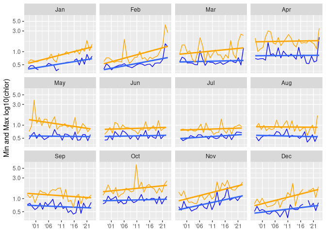

GOM-series chlorophyll
================

``` r
source("setup.R")
```

### CMEMS Copernicus multi-year chlorophyll

We downloaded monthly mean chlorophyll data from
[Copernicus](https://data.marine.copernicus.eu/product/OCEANCOLOUR_GLO_BGC_L4_MY_009_108/description)
to local storage in GeoTIFF format. From these we extracted mean
chlorophyll for each study region. Missing data were ignored
(`mean(x, na.rm = TRUE)`) before computing the mean.

``` r
x <- read_chlor_cmems(logscale = FALSE) |> 
  dplyr::mutate(month = factor(format(date, "%b"), levels = month.abb)) |>
  dplyr::group_by(region)
```

``` r
ggplot(data = x, aes(x = date, y = mean)) +
  geom_line() + 
  labs(y = "mean log10(chlorophyll)") + 
  geom_smooth(method = "lm", se = FALSE) +
  scale_y_log10() + 
  facet_wrap(~ region)
```

    ## `geom_smooth()` using formula = 'y ~ x'

    ## Warning: Removed 5 rows containing non-finite values (`stat_smooth()`).

<!-- -->

Show a panel of how monthly max and min values are changing over time
for a given region.

``` r
georges_basin = dplyr::filter(x, region == 'Georges Basin')
ggplot(data = georges_basin, aes(x = date, y = min)) +
  labs(y = "Min and Max log10(chlor)") + 
  geom_line(color = "blue", linewidth = 0.5) + 
  geom_smooth(method = "lm", se = FALSE) +
  geom_line(aes(x = date, y = max), color = "orange", linewidth = 0.5) + 
  geom_smooth(aes(x = date, y = max), method = "lm", se = FALSE, color = "orange") +
  scale_y_log10() + 
  scale_x_date(
    NULL,
    breaks = scales::breaks_width("5 years"),
    labels = scales::label_date("'%y")) + 
  facet_wrap(~ month)
```

    ## `geom_smooth()` using formula = 'y ~ x'

    ## Warning: Removed 5 rows containing non-finite values (`stat_smooth()`).

    ## `geom_smooth()` using formula = 'y ~ x'

    ## Warning: Removed 5 rows containing non-finite values (`stat_smooth()`).

<!-- -->

Another monthly analysis plot.

``` r
name = "Georges Basin"
plot(stsaav::stsaav(georges_basin,
                     t_step = "Month",
                     tcol = "date",
                     vcol = "mean"),
    main = paste0(name, ", mean Chlorophyll"))
```

<!-- -->

### Annual Means

Annual means can be computed from the various chlor metrics since each
month has the same number of pixels are sampled for each region.

Below we compute the annual means and then clip the data to just
complete years (meaning drop the current year). Then we plot the mean
max and min by region.

``` r
a <- annualize_chlor_cmems(x) |>
  dplyr::mutate(date = as.Date(paste0(year, "-01-01")), .before = 1) |>
  dplyr::filter(year < as.numeric(format(Sys.Date(), "%Y"))-1) |>
  dplyr::group_by(region)

ggplot(data = a, aes(x = date, y = min)) + 
  scale_y_log10() + 
  geom_line(color = "blue") +
  geom_line(aes(y = max), color = "orange") +
  scale_x_date(
    NULL,
    breaks = scales::breaks_width("5 years"),
    labels = scales::label_date("'%y")) + 
  labs(y = "Min and Max log10(chlor)") + 
  facet_wrap(~region)
```

<!-- -->

### Updating the local dataset

It’s easy to build or renew the local dataset.

    r <- fetch_chlor_cmems()
