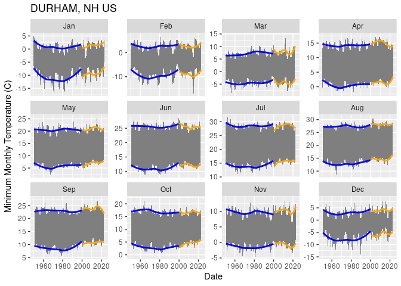
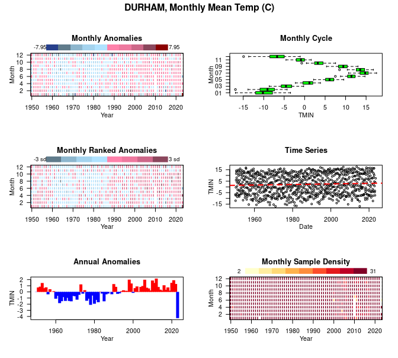
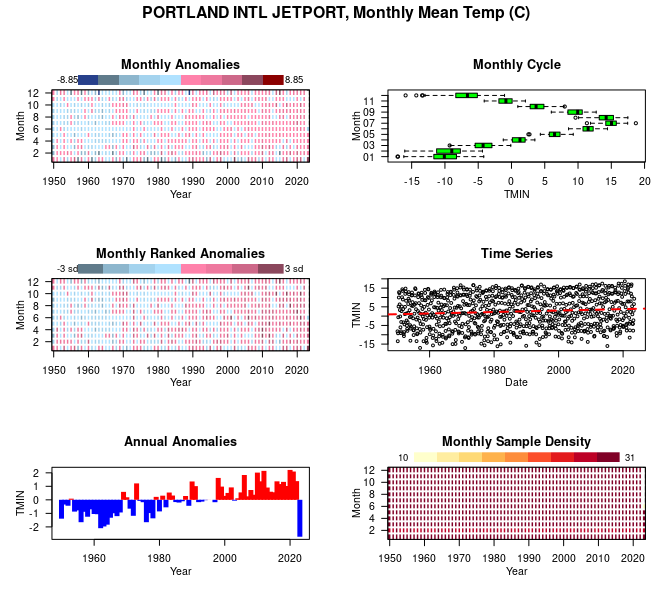

GOM-series GHCN daily
================

CANADA \# <https://climatedata.ca/download/#station-download>
<https://api.weather.gc.ca/collections/climate-daily/items?datetime=1840-03-01%2000:00:00/2023-05-02%2000:00:00&STN_ID=6244&sortby=PROVINCE_CODE,STN_ID,LOCAL_DATE&f=csv&limit=150000&startindex=0>

``` r
source("setup.R")
```

### GHCNd

We use the [ghcnd](https://github.com/BigelowLab/ghcnd) R package to
downlaod and wrangle daily data from NOAA’s [Global Historical
Climatology Network daily
(GHCNd)](https://www.ncei.noaa.gov/products/land-based-station/global-historical-climatology-network-daily).
We aggregate these daily values into monthly means.

We need to narrow the selection of stations into those along that lie
around the perimeter of the Gulf of Maine. We also hope to find stations
that provide long time series covering the intervals 1950-2000 and
2000-present.

``` r
station_ids = c(PWM = "USW00014764",
                BHC = "USC00190736",
                #LIA = "USW00014739",
                DNH = "USC00272174",
                ANP = "USC00170100",
                COR = "USC00171628")
stations = fetch_station_list() |>
  dplyr::filter(id %in% station_ids)

inv = fetch_inventory(stations = stations) |>
  dplyr::mutate(duration = lastyear - firstyear + 1)

bb = sf::st_bbox(c(xmin = -72, ymin = 39, xmax = -63,  ymax = 46), crs = 4326) |>
  sf::st_as_sfc()
coast = rnaturalearth::ne_coastline(scale= 'medium', returnclass = 'sf') |>
  sf::st_crop(bb)
```

    ## Warning: attribute variables are assumed to be spatially constant throughout
    ## all geometries

``` r
tmax = filter(inv, element == "TMAX")
ggplot(data = tmax) +
  geom_sf(size = 1.5) +
  geom_sf(data = st_geometry(coast)) +
  geom_sf_text(data = tmax, aes(label = name), 
               color = "blue", hjust = -0.1)
```

<!-- --> We can
now read in the per station per element data. We group the data into two
epochs, 1950-1999 and 2000-present.

``` r
DATES = c(as.Date(c("1950-01-01", "2000-01-01")), Sys.Date())
x = fetch_station(inv) |>
  aggregate_monthly() |>
  dplyr::filter(DATE >= DATES[1]) |>
  dplyr::mutate(TDIFF = TMAX - TMIN, .before = geometry)
ix <- findInterval(x$DATE, DATES)
x = dplyr::ungroup(x) |>
  dplyr::mutate(EPOCH = factor(as.character(sort(unique(ix)))[ix]), .after = DATE) |>
  dplyr::group_by(STATION, EPOCH) 
```

Let’s look at the station data - plotting the TMIN-to-TMAX range per
month range as a gray ribbon. Superimposed are the loess smoothing lines
for each epoch.

``` r
plot_envelope = function(x){
  ggplot(data = x,  aes(x = DATE, y = TMIN)) +
  geom_ribbon(aes(ymin = TMIN, ymax = TMAX), fill = 'gray50') +
   geom_smooth(data = dplyr::filter(x, EPOCH == 1), 
    aes(x = DATE, y = TMIN), method = loess, formula = y ~ x, se = FALSE, color = "blue") +
  geom_smooth(data = dplyr::filter(x, EPOCH == 2), 
    aes(x = DATE, y = TMIN), method = loess, formula = y ~ x, se = FALSE, color = "orange") +
  geom_smooth(data = dplyr::filter(x, EPOCH == 1), 
    aes(x = DATE, y = TMAX), method = loess, formula = y ~ x, se = FALSE, color = "blue") +
  geom_smooth(data = dplyr::filter(x, EPOCH == 2), 
    aes(x = DATE, y = TMAX), method = loess, formula = y ~ x, se = FALSE, color = "orange") +
  labs(x = "Date", y = "Minimum Monthly Temperature (C)", title = x$NAME[1]) + 
  facet_wrap(~ MONTH, scales = "free_y") 
}

gg = lapply(stations$id, function(id) plot_envelope(dplyr::filter(x, STATION == id)))

for (g in gg) print(g)
```

<!-- --><!-- --><!-- --><!-- --><!-- -->

Next we can view anomaly heat maps, but we start with the daily data.

``` r
x = fetch_station(inv) |>
  dplyr::filter(DATE >= DATES[1]) |>
  dplyr::mutate(TDIFF = TMAX - TMIN, .before = geometry)
```

``` r
for (id in stations$id) {
  name = stations$name[stations$id == id]
  plot( stsaav::stsaav(dplyr::filter(x, STATION == id),
                                     t_step = "Month",
                                     tcol = "DATE",
                                     vcol = "TMIN"),
        main = paste0(name, ", Monthly Mean Temp (C)"))
}
```

<!-- --><!-- --><!-- --><!-- --><!-- -->
