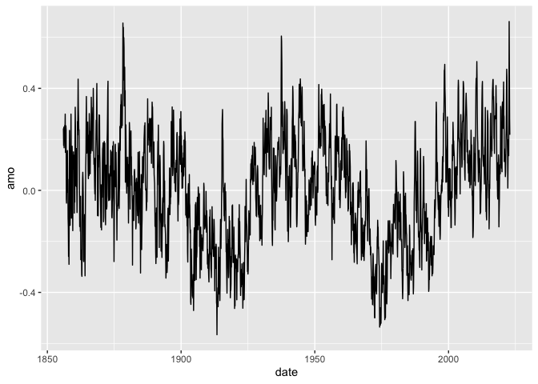
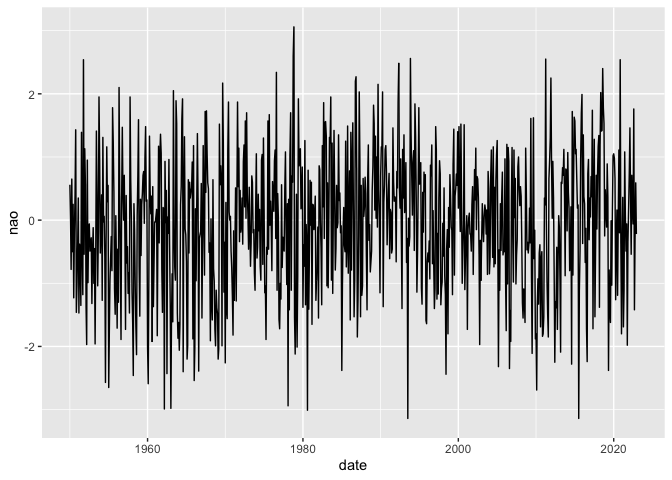

GOM-series NOAA Interannual Climate Indices
================

[NOAA Interannual Climate
Indices](https://psl.noaa.gov/data/climateindices/list/)

``` r
source("setup.R")
```

## Atlantic Multidecadal Oscillation (AMO) Index - long version

Enfield, D.B., A. M. Mestas-Nunez and P.J. Trimble, 2001: The Atlantic
multidecadal oscillation and it’s relation to rainfall and river flows
in the continental U.S.. Geophysical Research Letters, Vol. 28,
2077-2080.

``` r
read_amo(form="wide") |>
  glimpse()
```

    ## Rows: 167
    ## Columns: 13
    ## $ year <dbl> 1856, 1857, 1858, 1859, 1860, 1861, 1862, 1863, 1864, 1865, 1866,…
    ## $ jan  <dbl> 0.243, 0.238, -0.197, -0.109, 0.138, 0.023, -0.006, -0.125, -0.18…
    ## $ feb  <dbl> 0.176, -0.035, -0.290, -0.097, -0.089, -0.087, -0.142, -0.023, -0…
    ## $ mar  <dbl> 0.248, -0.050, -0.046, 0.083, 0.084, 0.016, -0.051, 0.049, -0.161…
    ## $ apr  <dbl> 0.167, 0.032, 0.235, 0.173, -0.046, 0.270, -0.104, 0.071, -0.015,…
    ## $ may  <dbl> 0.219, -0.008, 0.113, 0.110, 0.192, 0.217, -0.160, 0.044, 0.093, …
    ## $ jun  <dbl> 0.241, 0.124, -0.016, -0.078, 0.326, 0.314, -0.023, -0.021, 0.136…
    ## $ jul  <dbl> 0.255, 0.156, -0.137, -0.158, 0.252, 0.436, -0.272, -0.273, 0.281…
    ## $ aug  <dbl> 0.232, 0.022, -0.047, 0.086, 0.062, 0.324, -0.246, -0.279, 0.368,…
    ## $ sep  <dbl> 0.299, 0.043, 0.094, 0.103, 0.018, 0.281, -0.235, -0.137, 0.215, …
    ## $ oct  <dbl> 0.149, -0.110, 0.172, 0.151, 0.132, 0.236, -0.244, -0.213, 0.146,…
    ## $ nov  <dbl> 0.159, -0.144, 0.299, 0.083, 0.015, 0.238, -0.331, -0.157, 0.207,…
    ## $ dec  <dbl> 0.253, -0.259, 0.146, 0.105, 0.164, 0.137, -0.337, -0.095, 0.209,…

``` r
amo_long <- read_amo(form = "long") |>
  glimpse()
```

    ## Rows: 2,004
    ## Columns: 2
    ## $ date <date> 1856-01-01, 1856-02-01, 1856-03-01, 1856-04-01, 1856-05-01, 1856…
    ## $ amo  <dbl> 0.243, 0.176, 0.248, 0.167, 0.219, 0.241, 0.255, 0.232, 0.299, 0.…

``` r
ggplot(amo_long, aes(x=date, y=amo)) +
  geom_line()
```

<!-- -->

## North Atlantic Oscillation (NAO) Index

Hurrell, J.W., 1995: Decadal trends in the North Atlantic Oscillation
and relationships to regional temperature and precipitation. Science
269, 676-679.

Jones, P.D., Jónsson, T. and Wheeler, D., 1997: Extension to the North
Atlantic Oscillation using early instrumental pressure observations from
Gibraltar and South-West Iceland. Int. J. Climatol. 17, 1433-1450.

``` r
read_nao(form="wide") |>
  glimpse()
```

    ## Rows: 73
    ## Columns: 13
    ## $ year <dbl> 1950, 1951, 1952, 1953, 1954, 1955, 1956, 1957, 1958, 1959, 1960,…
    ## $ jan  <dbl> 0.56, -0.42, 0.57, -0.12, -0.08, -2.65, -0.76, 0.71, -1.14, -1.52…
    ## $ feb  <dbl> 0.01, 0.35, -1.38, -1.00, 0.40, -1.71, -1.71, -0.32, -1.64, 0.33,…
    ## $ mar  <dbl> -0.78, -1.47, -1.97, -0.45, -1.27, -0.96, -0.46, -1.73, -2.46, -0…
    ## $ apr  <dbl> 0.65, -0.38, 0.95, -1.96, 1.31, -0.60, -1.30, 0.39, 0.26, 0.25, 1…
    ## $ may  <dbl> -0.50, -0.50, -0.99, -0.56, -0.03, -0.26, 2.10, -0.68, -0.17, 0.4…
    ## $ jun  <dbl> 0.25, -1.35, -0.10, 1.41, 0.06, -0.80, 0.41, -0.42, -1.08, 0.71, …
    ## $ jul  <dbl> -1.23, 1.39, -0.06, 0.43, -0.57, 1.78, -0.72, -1.16, -1.69, 0.77,…
    ## $ aug  <dbl> -0.19, -0.41, -0.49, -1.04, -2.57, 1.25, -1.89, -0.83, -2.13, -0.…
    ## $ sep  <dbl> 0.39, -1.18, -0.38, -0.19, -0.28, 0.46, 0.38, -1.47, 0.08, 1.00, …
    ## $ oct  <dbl> 1.43, 2.54, -0.28, 1.95, 1.16, -1.09, 1.47, 1.95, 0.68, 1.48, -1.…
    ## $ nov  <dbl> -1.46, -0.54, -1.32, 0.96, 0.29, -1.49, 0.40, 0.63, 1.59, 0.30, -…
    ## $ dec  <dbl> -1.03, 1.13, -0.49, -0.52, 0.55, 0.07, 0.00, 0.02, -0.74, 0.32, -…

``` r
nao_long <- read_nao(form = "long") |>
  glimpse()
```

    ## Rows: 876
    ## Columns: 2
    ## $ date <date> 1950-01-01, 1950-02-01, 1950-03-01, 1950-04-01, 1950-05-01, 1950…
    ## $ nao  <dbl> 0.56, 0.01, -0.78, 0.65, -0.50, 0.25, -1.23, -0.19, 0.39, 1.43, -…

``` r
ggplot(nao_long, aes(x=date, y=nao)) +
  geom_line()
```

<!-- -->

## Gulf Stream Index (GSI)

``` r
read_gsi() |>
  glimpse()
```

    ## Rows: 816
    ## Columns: 2
    ## $ date <date> 1954-01-01, 1954-02-01, 1954-03-01, 1954-04-01, 1954-05-01, 1954…
    ## $ gsi  <dbl> 1.72374596, 1.88613100, 1.54812352, 1.51665538, 1.36922375, 1.763…

# Aggregating and exporting

## Aggregate a climate index by year

``` r
read_gsi() |>
  aggregate_climate_index() |>
  glimpse()
```

    ## Rows: 68
    ## Columns: 7
    ## $ date   <date> 1954-01-01, 1955-01-01, 1956-01-01, 1957-01-01, 1958-01-01, 19…
    ## $ min    <dbl> -0.7054446, -0.9944506, -1.2142227, -0.6664228, -2.1942221, -2.…
    ## $ q25    <dbl> 0.52036531, -0.49434191, -0.80205518, -0.10459647, -1.54099868,…
    ## $ median <dbl> 1.421017897, -0.149509610, -0.144962851, 0.076862532, -0.985360…
    ## $ mean   <dbl> 1.02788177, -0.15596674, -0.24112644, 0.10560797, -1.16604000, …
    ## $ q75    <dbl> 1.63593474, 0.23481269, 0.25289442, 0.27814072, -0.77375428, -1…
    ## $ max    <dbl> 1.88613100, 0.55928569, 0.56460633, 1.25557445, -0.45797480, -0…

## Export a wide table with all three climate indices aggregated by year

Use argument `complete_intervals` to only return years with no NA values
across any index - default is TRUE

``` r
export_climate_indices() |>
  glimpse()
```

    ## Rows: 68
    ## Columns: 19
    ## $ date       <date> 1954-01-01, 1955-01-01, 1956-01-01, 1957-01-01, 1958-01-01…
    ## $ amo.min    <dbl> -0.059, 0.033, -0.272, -0.129, 0.040, -0.068, 0.079, -0.029…
    ## $ nao.min    <dbl> -2.57, -2.65, -1.89, -1.73, -2.46, -1.52, -2.59, -1.83, -2.…
    ## $ gsi.min    <dbl> -0.7054446, -0.9944506, -1.2142227, -0.6664228, -2.1942221,…
    ## $ amo.q25    <dbl> -0.0370, 0.0780, -0.0975, -0.0855, 0.1540, -0.0245, 0.1475,…
    ## $ nao.q25    <dbl> -0.425, -1.290, -1.030, -0.995, -1.665, 0.100, -1.650, -0.5…
    ## $ gsi.q25    <dbl> 0.52036531, -0.49434191, -0.80205518, -0.10459647, -1.54099…
    ## $ amo.median <dbl> -0.0195, 0.1775, -0.0585, 0.0060, 0.1865, 0.0225, 0.2240, 0…
    ## $ nao.median <dbl> 0.015, -0.700, -0.230, -0.370, -0.910, 0.325, -0.350, 0.020…
    ## $ gsi.median <dbl> 1.421017897, -0.149509610, -0.144962851, 0.076862532, -0.98…
    ## $ amo.mean   <dbl> 0.02575000, 0.17491667, -0.03716667, 0.02216667, 0.19516667…
    ## $ nao.mean   <dbl> -0.08583333, -0.50000000, -0.17333333, -0.24250000, -0.7033…
    ## $ gsi.mean   <dbl> 1.02788177, -0.15596674, -0.24112644, 0.10560797, -1.166040…
    ## $ amo.q75    <dbl> 0.0900, 0.2550, 0.0335, 0.1085, 0.2120, 0.1015, 0.2900, 0.1…
    ## $ nao.q75    <dbl> 0.475, 0.265, 0.405, 0.510, 0.170, 0.740, 0.425, 1.050, 0.3…
    ## $ gsi.q75    <dbl> 1.63593474, 0.23481269, 0.25289442, 0.27814072, -0.77375428…
    ## $ amo.max    <dbl> 0.220, 0.378, 0.179, 0.213, 0.338, 0.116, 0.326, 0.217, 0.1…
    ## $ nao.max    <dbl> 1.31, 1.78, 2.10, 1.95, 1.59, 1.48, 1.33, 1.36, 0.96, 2.05,…
    ## $ gsi.max    <dbl> 1.88613100, 0.55928569, 0.56460633, 1.25557445, -0.45797480…
