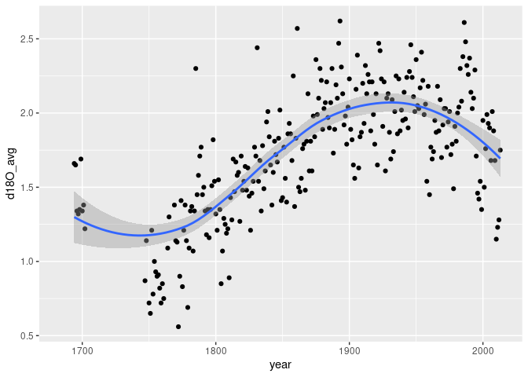
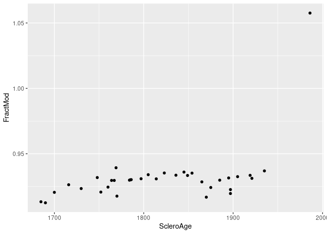

GOM-series paleo reconstructions
================

``` r
source("setup.R")
```

### [Gulf of Maine Oxygen and Nitrogen Isotope Data From 1684 - 2013 CE](https://www.ncei.noaa.gov/access/paleo-search/study/36473)

``` r
filename = wdspaleo::example_filename("seguin_whitney2022")
X = WDS_paleo(filename)
glimpse(X$data)
```

    ## Rows: 330
    ## Columns: 7
    ## $ year            <dbl> 1684, 1685, 1686, 1687, 1688, 1689, 1690, 1691, 1692, …
    ## $ d18O_avg        <dbl> NA, NA, NA, NA, NA, NA, NA, NA, NA, NA, 1.66, 1.65, 1.…
    ## $ d18O_sd         <dbl> NA, NA, NA, NA, NA, NA, NA, NA, NA, NA, NA, NA, NA, NA…
    ## $ d15N_start_year <dbl> NA, NA, NA, NA, NA, NA, NA, NA, NA, NA, NA, NA, NA, NA…
    ## $ d15N_end_year   <dbl> NA, NA, NA, NA, NA, NA, NA, NA, NA, NA, NA, NA, NA, NA…
    ## $ d15N_avg        <dbl> NA, NA, NA, NA, NA, NA, NA, NA, NA, NA, NA, NA, NA, NA…
    ## $ d15N_sd         <dbl> NA, NA, NA, NA, NA, NA, NA, NA, NA, NA, NA, NA, NA, NA…

### The contents of any given data source vary… so you’ll have to explore.

``` r
ggplot(data = X$data, aes(x = year, y = d18O_avg)) + 
  geom_point() +
  geom_smooth(se = TRUE)
```

    ## `geom_smooth()` using method = 'loess' and formula = 'y ~ x'

    ## Warning: Removed 60 rows containing non-finite values (`stat_smooth()`).

    ## Warning: Removed 60 rows containing missing values (`geom_point()`).

<!-- -->

### [Gulf of Maine age corrected radiocarbon data measured in Arctica islandica shells from 1685-1986](https://www.ncdc.noaa.gov/paleo/study/31392)

``` r
filename = wdspaleo::example_filename("lower-spies2020")
X = WDS_paleo(filename)
glimpse(X$data)
```

    ## Rows: 35
    ## Columns: 10
    ## $ SampleID     <chr> "100142", "121010", "121010_01", "121010_02", "121010_03"…
    ## $ `Accession#` <chr> "OS-84775", "OS-103968", "OS-124618", "OS-124515", "OS-12…
    ## $ ScleroAge    <dbl> 1685, 1690, 1700, 1716, 1730, 1748, 1752, 1760, 1764, 176…
    ## $ AgeRange     <dbl> 2.0, 3.0, 5.5, 9.5, 9.0, 14.5, 5.0, 3.0, 14.0, 2.5, 2.5, …
    ## $ FractMod     <dbl> 0.9133, 0.9125, 0.9205, 0.9263, 0.9234, 0.9318, 0.9207, 0…
    ## $ FractMod_err <dbl> 0.0030, 0.0027, 0.0025, 0.0021, 0.0019, 0.0019, 0.0032, 0…
    ## $ d13C         <dbl> 3.38, 3.41, 2.59, 2.16, 2.19, 2.31, 3.12, 2.91, 2.16, 3.4…
    ## $ D14C         <dbl> -56.9, -58.3, -51.2, -47.1, -51.7, -45.2, -56.9, -54.1, -…
    ## $ DeltaR       <dbl> -51, -46, -99, -123, -94, -161, -66, -94, -139, -135, -21…
    ## $ DeltaR_err   <dbl> 73.4, 73.4, 72.8, 72.8, 70.6, 69.6, 72.4, 71.5, 68.7, 73.…

``` r
ggplot(data = X$data, aes(x = ScleroAge, y = FractMod)) +
  geom_point()
```

<!-- -->
