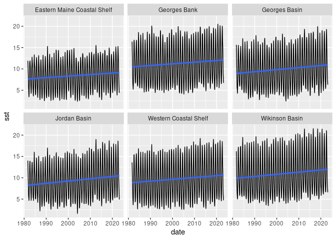
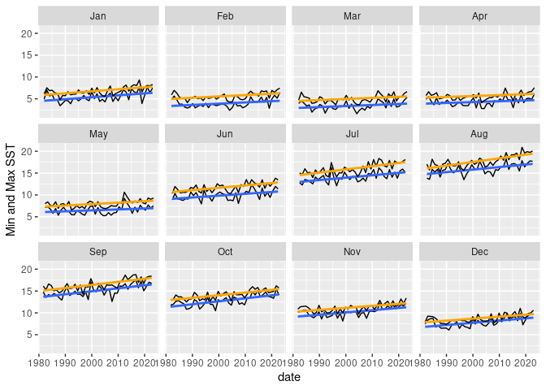

GOM-series sea surface temperature
================

``` r
source("setup.R")
```

### OISST monthly means

We downloaded monthly mean SST data from
[OISST](https://psl.noaa.gov/data/gridded/data.noaa.oisst.v2.highres.html).
For each region we computed the mean pixel value at each month.

``` r
x <- read_oisst() |> 
  dplyr::mutate(month = factor(format(date, "%b"), levels = month.abb)) |>
  dplyr::group_by(region)
```

``` r
ggplot(data = x, aes(x = date, y = sst)) +
  geom_line() + 
  geom_smooth(method = "lm", se = FALSE) +
  facet_wrap(~ region)
```

    ## `geom_smooth()` using formula = 'y ~ x'

<!-- -->

``` r
georges_basin = dplyr::filter(x, region == 'Georges Basin')
ggplot(data = georges_basin, aes(x = date, y = sst)) +
  geom_line() + 
  geom_smooth(method = "lm", se = FALSE) +
  facet_wrap(~ month)
```

    ## `geom_smooth()` using formula = 'y ~ x'

<!-- -->
