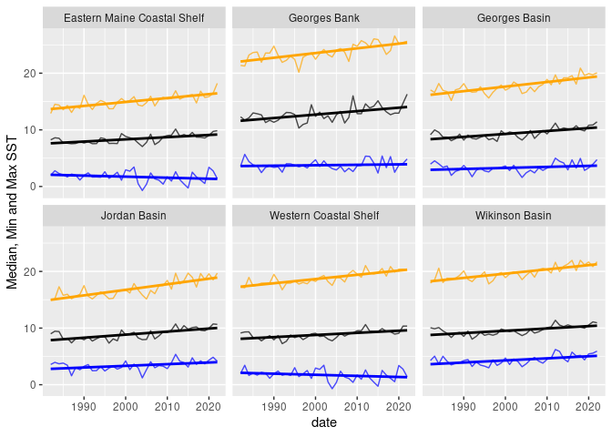

GOM-series sea surface temperature
================

``` r
source("setup.R")
```

### OISST monthly means

We downloaded monthly mean SST data from
[OISST](https://psl.noaa.gov/data/gridded/data.noaa.oisst.v2.highres.html).
For each region we computed the mean pixel value at each month.

> Note that we store the OISST data for by date for each subregion. This
> file can be updated as needed using `fetch_oisst()` - see below.

``` r
x <- read_oisst() |> 
  dplyr::mutate(month = factor(format(date, "%b"), levels = month.abb), .after = 1) |>
  dplyr::group_by(region) |>
  glimpse()
```

    ## Rows: 3,006
    ## Columns: 9
    ## Groups: region [6]
    ## $ date   <date> 1981-09-01, 1981-09-01, 1981-09-01, 1981-09-01, 1981-09-01, 19…
    ## $ month  <fct> Sep, Sep, Sep, Sep, Sep, Sep, Oct, Oct, Oct, Oct, Oct, Oct, Nov…
    ## $ region <chr> "Wikinson Basin", "Jordan Basin", "Georges Basin", "Georges Ban…
    ## $ min    <dbl> 14.319666, 11.613333, 14.788333, 15.543333, 11.422667, 12.50233…
    ## $ q25    <dbl> 15.697000, 13.124333, 15.300333, 16.594334, 11.506666, 12.57100…
    ## $ median <dbl> 16.632334, 13.955667, 15.470333, 17.645666, 12.154333, 12.94700…
    ## $ mean   <dbl> 16.379946, 13.768108, 15.530512, 17.456206, 11.993757, 13.36032…
    ## $ q75    <dbl> 17.042999, 14.469333, 15.928333, 17.687000, 12.413333, 14.11899…
    ## $ max    <dbl> 17.244333, 15.082999, 16.122000, 19.999332, 12.640666, 14.89266…

``` r
ggplot(data = x, aes(x = date, y = mean)) +
  geom_line() + 
  labs(y = "Mean SST") + 
  geom_smooth(method = "lm", se = FALSE) +
  facet_wrap(~ region)
```

<!-- -->

``` r
georges_basin = dplyr::filter(x, region == 'Georges Basin')
ggplot(data = georges_basin, aes(x = date, y = min)) +
  labs(y = "Min and Max SST") + 
  geom_line() + 
  geom_smooth(method = "lm", se = FALSE) +
  geom_line(aes(x = date, y = max)) + 
  geom_smooth(aes(x = date, y = max), method = "lm", se = FALSE, color = "orange") +
  facet_wrap(~ month)
```

<!-- -->

``` r
name = "Georges Basin"
plot(stsaav::stsaav(georges_basin,
                     t_step = "Month",
                     tcol = "date",
                     vcol = "mean"),
    main = paste0(name, ", Monthly Mean Temp (C)"))
```

<!-- -->

### Annual Means

Annual means can be computed from the various sst metrics since each
month has the same number of pixels are sampled for each region.

Below we compute the annual means and then clip the data to just
complete years (meaning drop the current year). Then we plot the mean
max and min by region.

``` r
a <- annualize_oisst(x) |>
  dplyr::filter(year < as.numeric(format(Sys.Date(), "%Y"))-1) |>
  dplyr::group_by(region)

ggplot(data = a, aes(x = year, y = min)) + 
  geom_line(color = "blue") +
  geom_line(aes(y = max), color = "orange") +
  facet_wrap(~region)
```

<!-- -->

### Updating the local dataset

It’s easy to build or renew the local dataset.

    r <- fetch_oisst()
