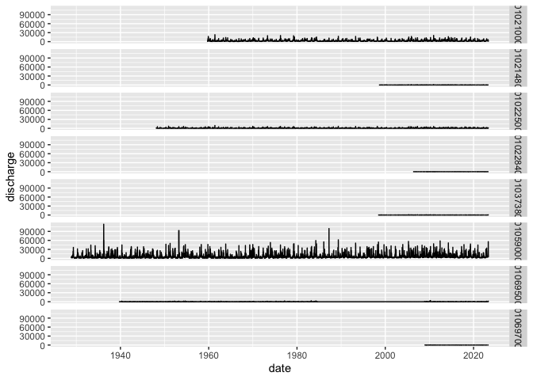

GOM-series stream guage data
================

``` r
source("setup.R")
```

# How to access [USGS Stream Gauge data for Maine](https://waterdata.usgs.gov/me/nwis/rt)

## List stations of interest

``` r
stations <- usgs_lut()
stations
```

    ## # A tibble: 8 × 4
    ##   site_no  name                                      lat   lon
    ##   <chr>    <chr>                                   <dbl> <dbl>
    ## 1 01021000 St. Croix River at Baring, Maine         45.1 -67.3
    ## 2 01021480 Old Stream near Wesley, Maine            44.9 -67.7
    ## 3 01022500 Narraguagus River at Cherryfield, Maine  44.6 -67.9
    ## 4 01022840 Otter Creek near Bar Harbor, Maine       44.3 -68.2
    ## 5 01037380 Ducktrap River near Lincolnville, Maine  44.3 -69.1
    ## 6 01059000 Androscoggin River near Auburn, Maine    44.1 -70.2
    ## 7 01069500 Mousam River near West Kennebunk, Maine  43.4 -70.7
    ## 8 01069700 Branch Brook near Kennebunk, Maine       43.4 -70.6

## Use the `readNWISdv` function from the [dataRetrieval]() package to get daily discharge values from the stations of interest

The parameter code “00060” is for daily discharge values in ft^3/s

``` r
parameterCd <- c("00060")

x <- fetch_usgs_discharge(stations)

x
```

    ## # A tibble: 136,654 × 4
    ##    agency_cd site_no  date       discharge
    ##    <chr>     <chr>    <date>         <dbl>
    ##  1 USGS      01021000 1959-10-01      2800
    ##  2 USGS      01021000 1959-10-02      2940
    ##  3 USGS      01021000 1959-10-03      1620
    ##  4 USGS      01021000 1959-10-04       656
    ##  5 USGS      01021000 1959-10-05      1870
    ##  6 USGS      01021000 1959-10-06      2670
    ##  7 USGS      01021000 1959-10-07      2850
    ##  8 USGS      01021000 1959-10-08      2950
    ##  9 USGS      01021000 1959-10-09      2880
    ## 10 USGS      01021000 1959-10-10      2780
    ## # ℹ 136,644 more rows

## Take a look at how much data is available per station

``` r
ggplot(data=x, aes(x=date, y=discharge)) +
  geom_line() +
  facet_grid(rows = "site_no")
```

<!-- -->
