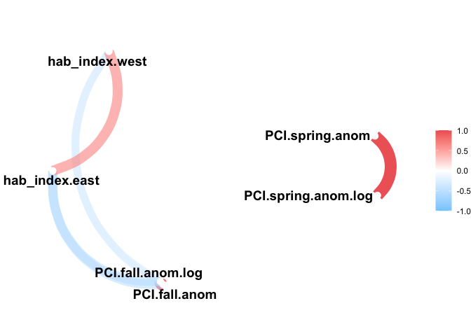
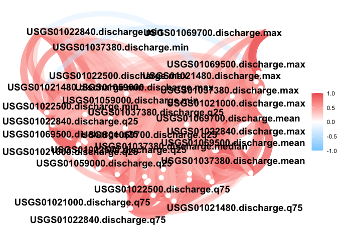
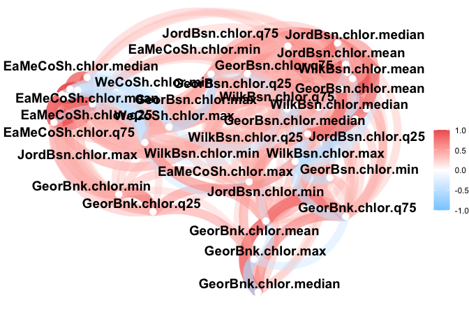

GOM-series Input Correlation Test
================

``` r
source("../setup.R")
```

``` r
x <- read_export(by = "year")
```

Use the function `network(x, include = c(vars))` where x is the table
from `read_export()` and include is a character vector of what variables
from x to include in the plot (these can be individual variable names or
keywords).

## Climate Indices

Each index is grouped with itself; NAO seems to be the most spread out;
NAO and AMO are negatively correlated

``` r
network(x, include=c("nao", "gsi", "amo"))
```

    ## Correlation computed with
    ## • Method: 'pearson'
    ## • Missing treated using: 'pairwise.complete.obs'

<!-- -->

## PCI and the HAB Index

``` r
network(x, include=c("pci", "hab"))
```

<!-- -->

## USGS

``` r
network(x, include=c("usgs"))
```

<!-- -->

## SST

The coastal shelf minimums seperate from the pack; Some Georges Bank
vars are on their own too

``` r
network(x, include=c("sst"))
```

<!-- -->

## SST + HAB

All negative relationships between both HAB indices and the SST vars

``` r
network(x, include=c("sst", "hab"))
```

<!-- -->

## Chlorophyll

Notice I had to use “chlor.” to exclude the buoy vars with “chlorophyll”

``` r
network(x, include=c("chlor."))
```

<!-- -->

## Try them all?

Things get busy…

``` r
network(x, include=c("nao", "gsi", "amo", "sst", "hab", "pci", "usgs", "chlor."))
```

<!-- -->
