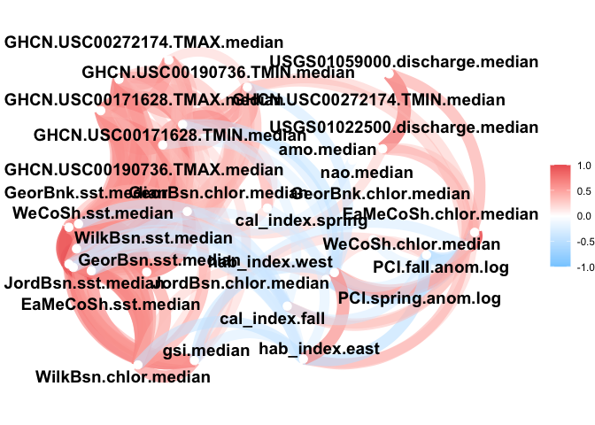
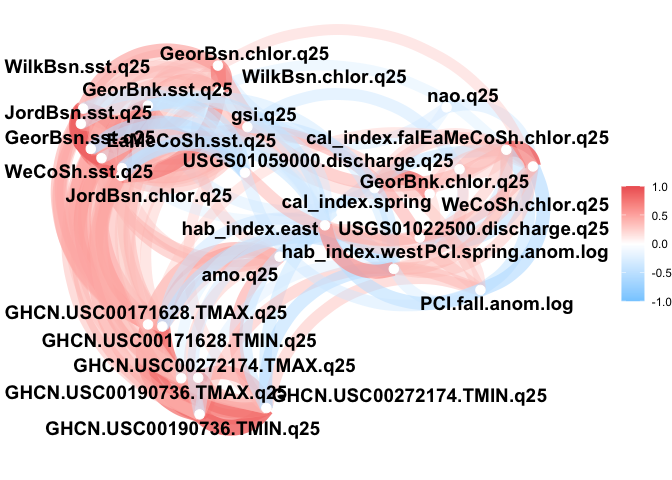
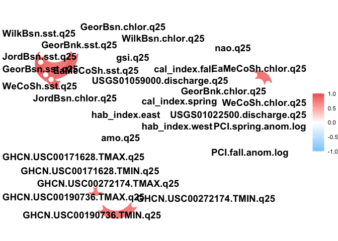
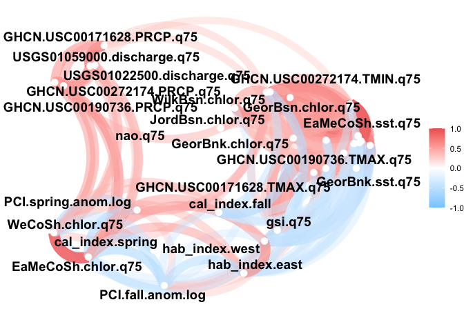
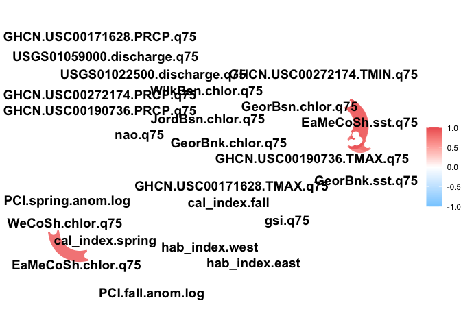
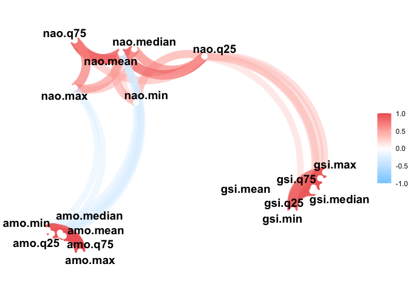
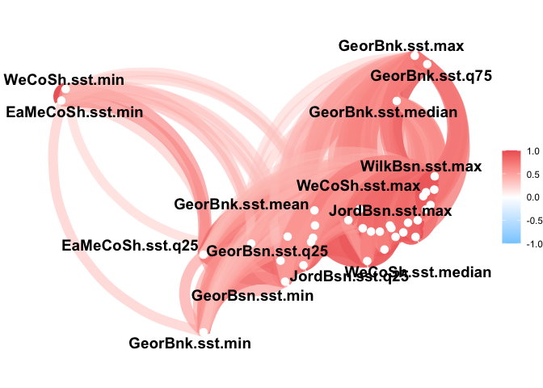
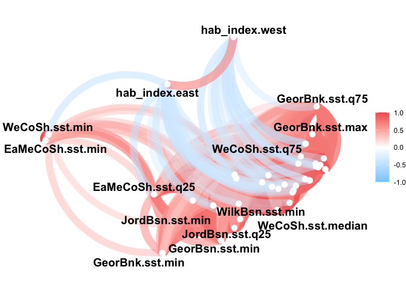

GOM-series Input Correlation Test
================

``` r
source("../setup.R")
```

``` r
x <- read_export(by = "year", selection = "all")
```

# Test the Selected Analysis Variables

Use the function `analysis_vars()` to read in the subset of variables
and supply them ti the include argument of `network()`

### Median

``` r
vars <- analysis_vars(treatment = "median")

vars
```

    ##  [1] "USGS01059000.discharge.median" "USGS01022500.discharge.median"
    ##  [3] "GHCN.USC00272174.PRCP.median"  "GHCN.USC00272174.TMAX.median" 
    ##  [5] "GHCN.USC00272174.TMIN.median"  "GHCN.USC00190736.PRCP.median" 
    ##  [7] "GHCN.USC00190736.TMAX.median"  "GHCN.USC00190736.TMIN.median" 
    ##  [9] "GHCN.USC00171628.PRCP.median"  "GHCN.USC00171628.TMAX.median" 
    ## [11] "GHCN.USC00171628.TMIN.median"  "nao.median"                   
    ## [13] "amo.median"                    "gsi.median"                   
    ## [15] "EaMeCoSh.sst.median"           "GeorBnk.sst.median"           
    ## [17] "GeorBsn.sst.median"            "JordBsn.sst.median"           
    ## [19] "WeCoSh.sst.median"             "WilkBsn.sst.median"           
    ## [21] "EaMeCoSh.chlor.median"         "GeorBnk.chlor.median"         
    ## [23] "GeorBsn.chlor.median"          "JordBsn.chlor.median"         
    ## [25] "WeCoSh.chlor.median"           "WilkBsn.chlor.median"         
    ## [27] "PCI.spring.anom.log"           "PCI.fall.anom.log"            
    ## [29] "hab_index.west"                "hab_index.east"

``` r
x |>
  network(include = vars)
```

<!-- -->

`network_plot()` uses a default 0.3 minimum r value to include a
correlation in the plot

Let’s try 0.8

``` r
x |>
  network(include = vars, min_cor = 0.8)
```

<!-- -->

### q25

``` r
network(x, include = analysis_vars(treatment = "q25"))
```

<!-- -->

Add `min_cor = 0.8`

``` r
network(x, include = analysis_vars(treatment = "q25"), min_cor = 0.8)
```

<!-- -->

### q75

``` r
network(x, include = analysis_vars(treatment = "q75"))
```

<!-- -->

Add `min_cor = 0.8`

``` r
network(x, include = analysis_vars(treatment = "q75"), min_cor = 0.8)
```

<!-- -->

# Initial correlation plots:

### Climate Indices

Each index is grouped with itself; NAO seems to be the most spread out;
NAO and AMO are negatively correlated

``` r
x |>
    dplyr::select(dplyr::contains(c("nao", "gsi", "amo"))) |>
    corrr::correlate() |>
    corrr::network_plot(colours = c("skyblue1", "white", "indianred2"))
```

    ## Correlation computed with
    ## • Method: 'pearson'
    ## • Missing treated using: 'pairwise.complete.obs'

<!-- -->

### PCI and the HAB Index

<!-- -->

### USGS

<!-- -->

### SST

The coastal shelf minimums seperate from the pack; Some Georges Bank
vars are on their own too

<!-- -->

### SST + HAB

All negative relationships between both HAB indices and the SST vars

<!-- -->

### Chlorophyll

Notice I had to use “chlor.” to exclude the buoy vars with “chlorophyll”

<!-- -->

### Try them all?

Things get busy…

<!-- -->
