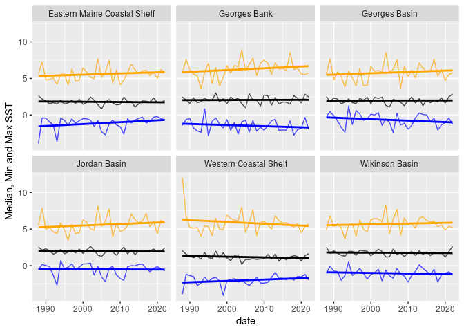

Blended Sea Winds (BSW)
================

``` r
source("../setup.R")
```

### BSW monthly stats

We downloaded monthly sea wind data from
[BSW](https://coastwatch.noaa.gov/cwn/products/noaa-ncei-blended-seawinds-nbs-v2.html).
For each region we computed the pixel statistics values at each month.

> Note that we store the BSW data for by date for each subregion. This
> file can be updated as needed using `fetch_bswm()` - see below.

``` r
x <- read_bswm() |> 
  dplyr::mutate(month = factor(format(date, "%b"), levels = month.abb), .after = 1) |>
  glimpse()
```

    ## Rows: 7,758
    ## Columns: 10
    ## $ date   <date> 1987-07-23, 1987-07-23, 1987-07-23, 1987-07-23, 1987-07-23, 19…
    ## $ month  <fct> Jul, Jul, Jul, Jul, Jul, Jul, Jul, Jul, Jul, Jul, Jul, Jul, Jul…
    ## $ var    <chr> "u_wind", "u_wind", "u_wind", "u_wind", "u_wind", "u_wind", "v_…
    ## $ region <chr> "Wikinson Basin", "Jordan Basin", "Georges Basin", "Georges Ban…
    ## $ min    <dbl> 0.275406927, 0.380417109, 0.096577249, 0.040166762, 0.004036248…
    ## $ q25    <dbl> 0.5708913, 0.5780752, 0.1299248, 0.2546863, 0.9814088, 0.499477…
    ## $ median <dbl> 0.7049016, 0.8786538, 0.1621024, 0.3760958, 1.4752451, 0.981408…
    ## $ mean   <dbl> 0.7026565, 0.9299924, 0.1753238, 0.3671849, 1.3359784, 0.822581…
    ## $ q75    <dbl> 0.8289483, 1.2173259, 0.1940996, 0.4828591, 1.9034610, 1.678808…
    ## $ max    <dbl> 1.1140124, 1.4335756, 0.3478809, 0.6162763, 2.0142667, 1.927562…

Let’s tally the number of parameters…

``` r
dplyr::count(x, var)
```

    ## # A tibble: 3 × 2
    ##   var           n
    ##   <chr>     <int>
    ## 1 u_wind     2586
    ## 2 v_wind     2586
    ## 3 windspeed  2586

``` r
x <- dplyr::group_by(x, region)

ggplot(data = dplyr::filter(x, var == "windspeed"), aes(x = date, y = q75)) +
  geom_line() + 
  labs(y = "Q75 Wind Speed") + 
  geom_smooth(method = "lm", se = FALSE, formula = y ~ x) +
  facet_wrap(~ region)
```

<!-- -->

``` r
georges_bank = dplyr::filter(x, region == 'Georges Bank', var == "windspeed")
ggplot(data = georges_bank, aes(x = date, y = min)) +
  labs(y = "Min and Max Winds") + 
  geom_line() + 
  geom_smooth(method = "lm", se = FALSE) +
  geom_line(aes(x = date, y = max)) + 
  geom_smooth(aes(x = date, y = max), method = "lm", se = FALSE, color = "orange") +
  facet_wrap(~ month)
```

<!-- -->

``` r
name = "Georges Bank"
plot(stsaav::stsaav(georges_bank,
                     t_step = "Month",
                     tcol = "date",
                     vcol = "median"),
    main = paste0(name, ", Monthly Median Windspeed"))
```

<!-- --> \###
Annual Metrics

Annual metrics can be computed from the various wind variables since
each month has the same number of pixels are sampled for each region.
Partial years are not computed.

``` r
a <- aggregate_bswm(x) |>
  dplyr::group_by(region) |>
  dplyr::filter(var %in% c("windspeed"))

ggplot(data = a, aes(x = date, y = median)) + 
  geom_line(color = "black", alpha = 0.7) +
  geom_smooth(method = "lm", se = FALSE, color = "black") +
  geom_line(aes(x = date, y = min), color = "blue", alpha = 0.7) +
  geom_smooth(aes(x = date, y = min), method = "lm", se = FALSE, color = "blue") +
  geom_line(aes(x = date, y = max), color = "orange", alpha = 0.7) + 
  geom_smooth(aes(x = date, y = max), method = "lm", se = FALSE, color = "orange") + 
  labs(y = "Median, Min and Max SST") + 
  facet_wrap(~region)
```

<!-- --> \###
Surprises

``` r
x = widen_bswm(by = "year")
s = surprise(x, win = 20)
```

``` r
plot_surprise(s)
```

<!-- -->

### Updating the local dataset

It’s easy to build or renew the local dataset.

    r <- fetch_bswm()
