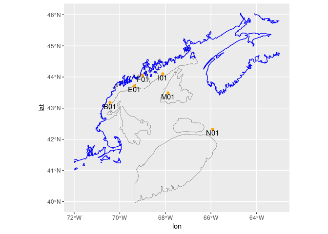
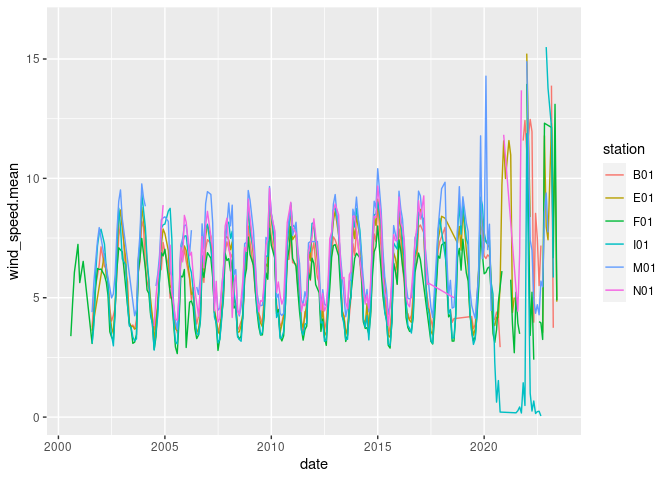
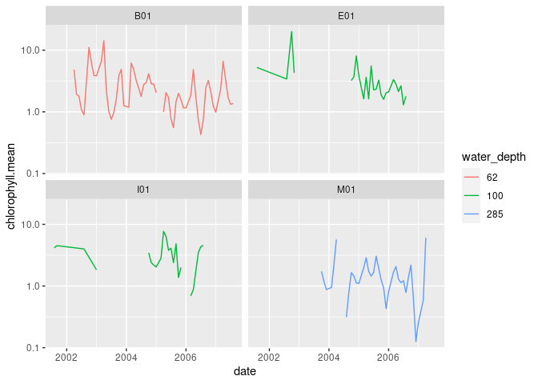
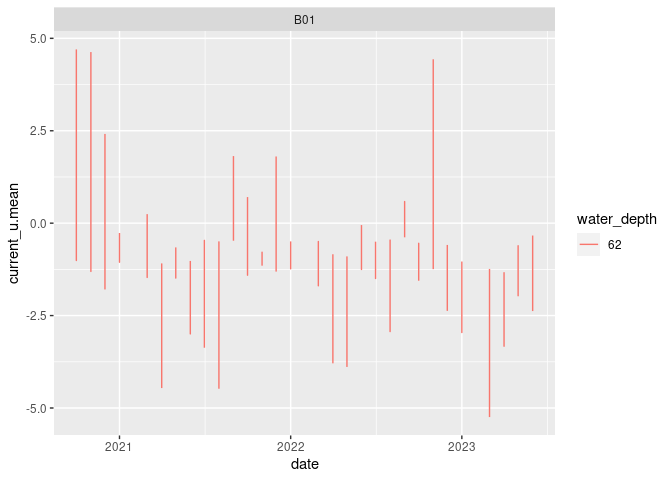

GOM-Series Buoys
================

``` r
suppressPackageStartupMessages({
  library(cofbb)
})
source("../setup.R")

bb <- cofbb::get_bb("gom", form = 'sf')
regions = read_regions()
coast = rnaturalearth::ne_coastline(scale = "large", returnclass = 'sf') |>
  sf::st_crop(sf::st_bbox(bb))
```

## Buoy data aggregated to monthly means

5 buoys from across the Gulf of Maine were selected for inclusion. A
listing of these is saved in `data/buoy-listings.csv` and can be read as
simple look-up table (lut).

``` r
buoys = buoy_lut()
buoys
```

    ## # A tibble: 6 × 5
    ##   name  longname            id      lon   lat
    ##   <chr> <chr>               <chr> <dbl> <dbl>
    ## 1 wms   Western Maine Shelf B01   -70.4  43.2
    ## 2 cms   Central Maine Shelf E01   -69.4  43.7
    ## 3 pb    Penobscot Bay       F01   -69.0  44.1
    ## 4 ems   Eastern Maine Shelf I01   -68.1  44.1
    ## 5 jb    Jordan Basin        M01   -67.9  43.5
    ## 6 nec   Northeast Channel   N01   -65.9  42.3

``` r
ggplot(data = regions) +
  geom_sf(fill = NA) +
  geom_sf(data = coast, color = "blue") + 
  geom_point(data = buoys, aes(x = lon, y = lat), color = "orange") +
  geom_text(data = buoys, aes(x = lon, y = lat, 
                              label = id,
                              hjust = 0.5, 
                              vjust = 1.2))
```

<!-- -->

## MET

### Fetch meteorological (met) data

Meteorological data for these buoys can be fetched using
`fetch_buoy_met()`. This function downloads high temporal resolution
data per buoy, and aggregates into monthly means, and saved to disk a
simple table. Run this as needed to update data.

    met <- lapply(buoys$id, fetch_buoy_met)

### Read and display met data

Read one or more buoy met data files using `read_buoy_met()`. By default
all buoys are read and boundinto one table.

``` r
x <- read_buoy_met() |>
  dplyr::mutate(month = format(date, "%b"), .after = date) |>
  dplyr::group_by(station)

ggplot(data = x, aes(x = date, y = wind_speed.mean, color = station, shape = station)) +
  geom_line()
```

    ## Warning: Removed 6 rows containing missing values (`geom_line()`).

<!-- -->

``` r
ggplot(data = filter(x, month == 'Aug'), 
       aes(x = date, y = air_temperature.mean, color = station)) +
  geom_point() + 
  geom_smooth(method = "lm", se=FALSE) +
  labs(x = "year", y = 'Air Temp (C)', title = "August - mean monthly air temperature")
```

    ## `geom_smooth()` using formula = 'y ~ x'

    ## Warning: Removed 1 rows containing non-finite values (`stat_smooth()`).

    ## Warning: Removed 1 rows containing missing values (`geom_point()`).

<!-- -->

## CTD at depth (temp, salinity, sigma_t)

### Fetch CTD data

CTD data for these buoys can be fetched using `fetch_buoy_ctd()`. This
function downloads high temporal resolution data per buoy at various
depths, and aggregates into monthly means, and saved to disk a simple
table. Run this as needed to update data.

    ctd <- lapply(buoys$id, fetch_buoy_ctd)

### Read and display CTD data

Read one or more buoy CTD data files using `read_buoy_ctd()`. By default
all buoys are read and bound into one table.

``` r
x <- read_buoy_ctd() |>
  dplyr::mutate(depth = factor(as.integer(depth))) |>
  dplyr::mutate(month = format(date, "%b"), .after = date) |>
  dplyr::group_by(station)
```

    ## Warning: There was 1 warning in `dplyr::mutate()`.
    ## ℹ In argument: `depth = factor(as.integer(depth))`.
    ## Caused by warning in `factor()`:
    ## ! NAs introduced by coercion to integer range

``` r
ggplot(data = x, aes(x = date, y = temperature.mean, color = depth)) +
  scale_y_reverse()  + 
  geom_line() + 
  facet_wrap(~station)
```

<!-- -->

## OPTICS at depth (solar_zenith_angle, Ed_PAR, chlorophyll)

### Fetch OPTICS data

OPTICS data for these buoys can be fetched using `fetch_buoy_optics()`.
This function downloads high temporal resolution data per buoy at
various depths, and aggregates into monthly means, and saved to disk a
simple table. Run this as needed to update data. Not every buoy has
optics data.

    ctd <- lapply(buoys$id, fetch_buoy_optics)

### Read and display OPTICS data

Read one or more buoy CTD data files using `read_buoy_ctd()`. By default
all buoys are read and bound into one table. Note it seems these
measures are not at the surface but instead are at varying depths.

``` r
x <- read_buoy_optics() |>
  dplyr::mutate(month = format(date, "%b"), .after = date) |>
  dplyr::mutate(water_depth = factor(water_depth)) |>
  dplyr::group_by(station)

count(x, station, water_depth)
```

    ## # A tibble: 4 × 3
    ## # Groups:   station [4]
    ##   station water_depth     n
    ##   <chr>   <fct>       <int>
    ## 1 B01     62             59
    ## 2 E01     100            41
    ## 3 I01     100            43
    ## 4 M01     285            39

``` r
ggplot(data = x, aes(x = date, y = chlorophyll.mean, color = water_depth)) +
  scale_y_log10() + 
  geom_line() + 
  facet_wrap(~station)
```

    ## Warning: Removed 2 rows containing missing values (`geom_line()`).

<!-- -->

## ACDP at depth (water_depth, depth, current_u, current_v)

### Fetch ACDP data

ACDP data for these buoys can be fetched using `fetch_buoy_acdp()`. This
function downloads high temporal resolution data per buoy at various
depths, aggregates into monthly means and yearly, and saved to disk
simple tables. Run this as needed to update data. Not every buoy has
ADCP data.

    adcp <- lapply(buoys$id, fetch_buoy_adcp)

### Read and display ADCP data

Read one or more buoy ADCP data files using `read_buoy_adcp()`. By
default all buoys are read and bound into one table.

``` r
x <- read_buoy_adcp() |>
  dplyr::mutate(month = format(date, "%b"), .after = date) |>
  dplyr::mutate(water_depth = factor(water_depth)) |>
  dplyr::group_by(station)

count(x, station, water_depth)
```

    ## # A tibble: 1 × 3
    ## # Groups:   station [1]
    ##   station water_depth     n
    ##   <chr>   <fct>       <int>
    ## 1 B01     62            720

``` r
ggplot(data = x, aes(x = date, y = current_u.mean, color = water_depth)) +
  geom_line() + 
  facet_wrap(~station)
```

    ## Warning: Removed 12 rows containing missing values (`geom_line()`).

<!-- -->

## RTSC at surface (current_speed, current_direction, temperature)

### Read and display RTSC data

Read one or more buoy RTSC data files using `read_buoy_rtsc()`. By
default all buoys are read and bound into one table.

``` r
x <- read_buoy_rtsc() |>
  dplyr::mutate(month = format(date, "%b"), .after = date) |>
  dplyr::mutate(water_depth = factor(depth)) |>
  dplyr::group_by(station)

count(x, station, depth)
```

    ## # A tibble: 6 × 3
    ## # Groups:   station [6]
    ##   station depth     n
    ##   <chr>   <dbl> <int>
    ## 1 B01         2   229
    ## 2 E01         2   224
    ## 3 F01         2   215
    ## 4 I01         2   225
    ## 5 M01         2   202
    ## 6 N01         2   151

``` r
ggplot(data = x, aes(x = date, y = current_direction_u.mean)) +
  geom_line() + 
  geom_smooth(method = "lm", se=FALSE) +
  facet_wrap(~station)
```

    ## `geom_smooth()` using formula = 'y ~ x'

<!-- -->
