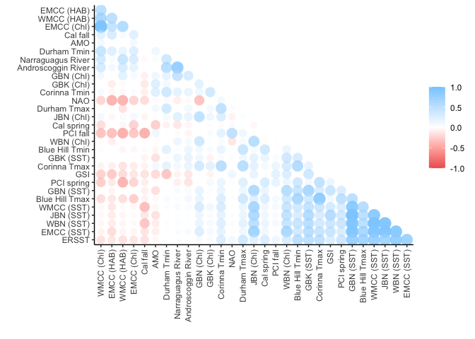
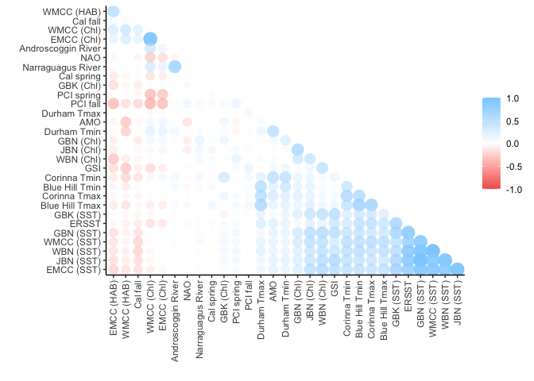

Correlation Plot Comparison
================

``` r
source("../setup.R")
```

## Read analysis data from the export file

``` r
x = read_export(by = 'year', 
                selection = read_target_vars(treatment = c("median")),
                replace_names = TRUE, 
                standardize = FALSE) |>
  dplyr::filter(date >= as.Date("1900-01-01"))

glimpse(x)
```

    ## Rows: 123
    ## Columns: 31
    ## $ date                 <date> 1900-01-01, 1901-01-01, 1902-01-01, 1903-01-01, …
    ## $ `Androscoggin River` <dbl> NA, NA, NA, NA, NA, NA, NA, NA, NA, NA, NA, NA, N…
    ## $ `Narraguagus River`  <dbl> NA, NA, NA, NA, NA, NA, NA, NA, NA, NA, NA, NA, N…
    ## $ `Durham Tmax`        <dbl> 13.30, 12.20, 15.60, 14.40, 12.80, 13.90, 14.40, …
    ## $ `Durham Tmin`        <dbl> 2.20, 2.80, 3.30, 2.80, 0.60, 1.10, 1.10, NA, 2.8…
    ## $ `Blue Hill Tmax`     <dbl> 13.9, 12.2, 15.0, 13.9, NA, 13.9, 14.4, 11.7, 14.…
    ## $ `Blue Hill Tmin`     <dbl> 5.0, 3.3, 5.0, 5.0, NA, 3.9, 4.4, 2.8, 4.4, 4.4, …
    ## $ `Corinna Tmax`       <dbl> NA, NA, NA, NA, NA, NA, NA, NA, NA, NA, NA, NA, N…
    ## $ `Corinna Tmin`       <dbl> NA, NA, NA, NA, NA, NA, NA, NA, NA, NA, NA, NA, N…
    ## $ NAO                  <dbl> -0.135, -0.590, -0.150, 0.325, 0.340, -0.120, 0.3…
    ## $ AMO                  <dbl> 0.0875, 0.1270, -0.0930, -0.1610, -0.3640, -0.197…
    ## $ GSI                  <dbl> NA, NA, NA, NA, NA, NA, NA, NA, NA, NA, NA, NA, N…
    ## $ ERSST                <dbl> 10.225206, 10.395330, 9.757008, 10.393538, 10.231…
    ## $ `EMCC (SST)`         <dbl> NA, NA, NA, NA, NA, NA, NA, NA, NA, NA, NA, NA, N…
    ## $ `GBK (SST)`          <dbl> NA, NA, NA, NA, NA, NA, NA, NA, NA, NA, NA, NA, N…
    ## $ `GBN (SST)`          <dbl> NA, NA, NA, NA, NA, NA, NA, NA, NA, NA, NA, NA, N…
    ## $ `JBN (SST)`          <dbl> NA, NA, NA, NA, NA, NA, NA, NA, NA, NA, NA, NA, N…
    ## $ `WMCC (SST)`         <dbl> NA, NA, NA, NA, NA, NA, NA, NA, NA, NA, NA, NA, N…
    ## $ `WBN (SST)`          <dbl> NA, NA, NA, NA, NA, NA, NA, NA, NA, NA, NA, NA, N…
    ## $ `EMCC (Chl)`         <dbl> NA, NA, NA, NA, NA, NA, NA, NA, NA, NA, NA, NA, N…
    ## $ `GBK (Chl)`          <dbl> NA, NA, NA, NA, NA, NA, NA, NA, NA, NA, NA, NA, N…
    ## $ `GBN (Chl)`          <dbl> NA, NA, NA, NA, NA, NA, NA, NA, NA, NA, NA, NA, N…
    ## $ `JBN (Chl)`          <dbl> NA, NA, NA, NA, NA, NA, NA, NA, NA, NA, NA, NA, N…
    ## $ `WMCC (Chl)`         <dbl> NA, NA, NA, NA, NA, NA, NA, NA, NA, NA, NA, NA, N…
    ## $ `WBN (Chl)`          <dbl> NA, NA, NA, NA, NA, NA, NA, NA, NA, NA, NA, NA, N…
    ## $ `PCI spring`         <dbl> NA, NA, NA, NA, NA, NA, NA, NA, NA, NA, NA, NA, N…
    ## $ `PCI fall`           <dbl> NA, NA, NA, NA, NA, NA, NA, NA, NA, NA, NA, NA, N…
    ## $ `WMCC (HAB)`         <dbl> NA, NA, NA, NA, NA, NA, NA, NA, NA, NA, NA, NA, N…
    ## $ `EMCC (HAB)`         <dbl> NA, NA, NA, NA, NA, NA, NA, NA, NA, NA, NA, NA, N…
    ## $ `Cal spring`         <dbl> NA, NA, NA, NA, NA, NA, NA, NA, NA, NA, NA, NA, N…
    ## $ `Cal fall`           <dbl> NA, NA, NA, NA, NA, NA, NA, NA, NA, NA, NA, NA, N…

Let’s also read the table with standardized values

``` r
x_standard = read_export(by = 'year', 
                         selection = read_target_vars(treatment = c("median")),
                         replace_names = TRUE, 
                         standardize = TRUE) |>
  dplyr::filter(date >= as.Date("1900-01-01"))

glimpse(x_standard)
```

    ## Rows: 123
    ## Columns: 31
    ## $ date                 <date> 1900-01-01, 1901-01-01, 1902-01-01, 1903-01-01, …
    ## $ `Androscoggin River` <dbl> NA, NA, NA, NA, NA, NA, NA, NA, NA, NA, NA, NA, N…
    ## $ `Narraguagus River`  <dbl> NA, NA, NA, NA, NA, NA, NA, NA, NA, NA, NA, NA, N…
    ## $ `Durham Tmax`        <dbl> -1.5555083, -2.4451278, 0.3046052, -0.6658888, -1…
    ## $ `Durham Tmin`        <dbl> -0.0705963, 0.5100385, 0.9939008, 0.5100385, -1.6…
    ## $ `Blue Hill Tmax`     <dbl> -0.56013043, -2.22797296, 0.51906180, -0.56013043…
    ## $ `Blue Hill Tmin`     <dbl> 0.1561375, -1.6700470, 0.1561375, 0.1561375, NA, …
    ## $ `Corinna Tmax`       <dbl> NA, NA, NA, NA, NA, NA, NA, NA, NA, NA, NA, NA, N…
    ## $ `Corinna Tmin`       <dbl> NA, NA, NA, NA, NA, NA, NA, NA, NA, NA, NA, NA, N…
    ## $ NAO                  <dbl> -0.3341017, -1.0672455, -0.3582713, 0.4070987, 0.…
    ## $ AMO                  <dbl> 0.4831298, 0.6964260, -0.4915530, -0.8587465, -1.…
    ## $ GSI                  <dbl> NA, NA, NA, NA, NA, NA, NA, NA, NA, NA, NA, NA, N…
    ## $ ERSST                <dbl> -0.553882642, -0.342110604, -1.136698889, -0.3443…
    ## $ `EMCC (SST)`         <dbl> NA, NA, NA, NA, NA, NA, NA, NA, NA, NA, NA, NA, N…
    ## $ `GBK (SST)`          <dbl> NA, NA, NA, NA, NA, NA, NA, NA, NA, NA, NA, NA, N…
    ## $ `GBN (SST)`          <dbl> NA, NA, NA, NA, NA, NA, NA, NA, NA, NA, NA, NA, N…
    ## $ `JBN (SST)`          <dbl> NA, NA, NA, NA, NA, NA, NA, NA, NA, NA, NA, NA, N…
    ## $ `WMCC (SST)`         <dbl> NA, NA, NA, NA, NA, NA, NA, NA, NA, NA, NA, NA, N…
    ## $ `WBN (SST)`          <dbl> NA, NA, NA, NA, NA, NA, NA, NA, NA, NA, NA, NA, N…
    ## $ `EMCC (Chl)`         <dbl> NA, NA, NA, NA, NA, NA, NA, NA, NA, NA, NA, NA, N…
    ## $ `GBK (Chl)`          <dbl> NA, NA, NA, NA, NA, NA, NA, NA, NA, NA, NA, NA, N…
    ## $ `GBN (Chl)`          <dbl> NA, NA, NA, NA, NA, NA, NA, NA, NA, NA, NA, NA, N…
    ## $ `JBN (Chl)`          <dbl> NA, NA, NA, NA, NA, NA, NA, NA, NA, NA, NA, NA, N…
    ## $ `WMCC (Chl)`         <dbl> NA, NA, NA, NA, NA, NA, NA, NA, NA, NA, NA, NA, N…
    ## $ `WBN (Chl)`          <dbl> NA, NA, NA, NA, NA, NA, NA, NA, NA, NA, NA, NA, N…
    ## $ `PCI spring`         <dbl> NA, NA, NA, NA, NA, NA, NA, NA, NA, NA, NA, NA, N…
    ## $ `PCI fall`           <dbl> NA, NA, NA, NA, NA, NA, NA, NA, NA, NA, NA, NA, N…
    ## $ `WMCC (HAB)`         <dbl> NA, NA, NA, NA, NA, NA, NA, NA, NA, NA, NA, NA, N…
    ## $ `EMCC (HAB)`         <dbl> NA, NA, NA, NA, NA, NA, NA, NA, NA, NA, NA, NA, N…
    ## $ `Cal spring`         <dbl> NA, NA, NA, NA, NA, NA, NA, NA, NA, NA, NA, NA, N…
    ## $ `Cal fall`           <dbl> NA, NA, NA, NA, NA, NA, NA, NA, NA, NA, NA, NA, N…

## Correlation test using 1900-2022

Here’s the correlation plot for the non-standardized (median) export
table using 1900 to present and ‘pairwise.complete.obs’

Note that we are using `corrr::rearrange()` which arranges the matrix
based on correlations, so if the order changes, the test is yielding a
different result.

``` r
c <- x |>
  correlate() |>
  rearrange() |>
  shave()
```

    ## Non-numeric variables removed from input: `date`
    ## Correlation computed with
    ## • Method: 'pearson'
    ## • Missing treated using: 'pairwise.complete.obs'
    ## Registered S3 methods overwritten by 'registry':
    ##   method               from 
    ##   print.registry_field proxy
    ##   print.registry_entry proxy

``` r
rplot(c) +
  theme(axis.text.x = element_text(angle = 90, vjust = 0.5, hjust=1))
```

<!-- -->

Correlation plot for the standardized version yields an almost identical
result

``` r
c <- x_standard |>
  correlate() |>
  rearrange() |>
  shave()

rplot(c) +
  theme(axis.text.x = element_text(angle = 90, vjust = 0.5, hjust=1))
```

<!-- -->

## What if we use ‘complete.obs’?

The plot changes. We see different relationships come out in the plot
and the variables are ordered differently on each axis.

``` r
c <- x_standard |>
  correlate(use="complete.obs") |>
  rearrange() |>
  shave()

rplot(c) +
  theme(axis.text.x = element_text(angle = 90, vjust = 0.5, hjust=1))
```

<!-- -->

## Correlation test using 1970-2022

``` r
x_standard <- x_standard |>
  filter(date >= as.Date("1970-01-01"))
```

Standardized version starting in 1970 still using
‘pairwise.complete.obs’

``` r
c <- x_standard |>
  correlate() |>
  rearrange() |>
  shave()

rplot(c) +
  theme(axis.text.x = element_text(angle = 90, vjust = 0.5, hjust=1))
```

<!-- -->

Standardized version staring in 1970 using ‘complete.obs’

``` r
c <- x_standard |>
  correlate(use="complete.obs") |>
  rearrange() |>
  shave()

rplot(c) +
  theme(axis.text.x = element_text(angle = 90, vjust = 0.5, hjust=1))
```

<!-- -->

So, the question is: which do we choose? Or maybe: what information do
we want the reader to gain from this figure?
