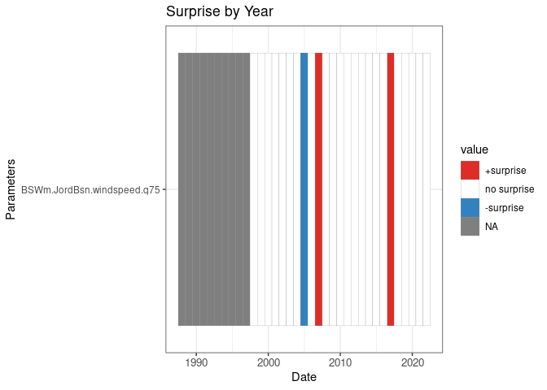
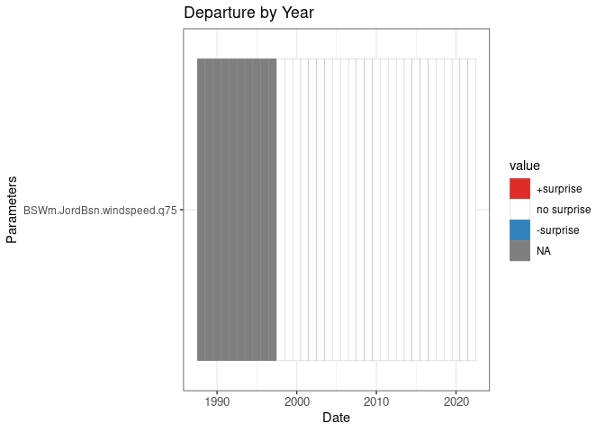
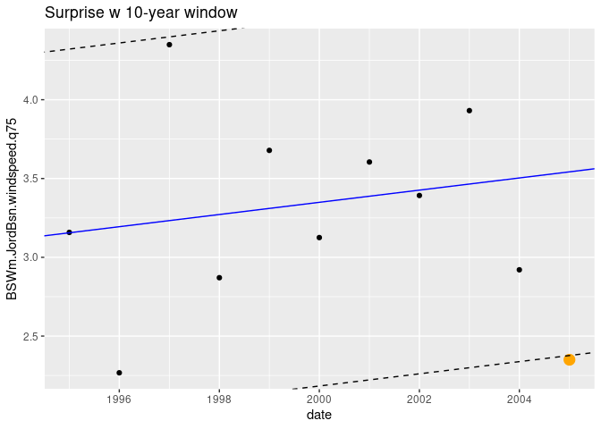
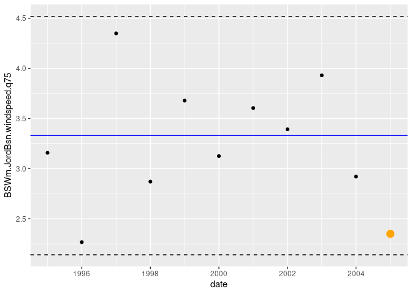

Departure vs Surprise
================

How do we think about the surprise statistics compared to an old
fashioned “departure from the usual”? Both are relative measures of the
‘distance’ a given measurement is from some center-seeking statistic.
So, for example, “departure from the mean” computes the distance a given
value is from the mean of a pool of values, in units of standard
deviations of the pool. Surprise is similar, except that the
center-seeking is a linear fit, and the ‘surprise’ value is the distance
a given value is from that trend in units of standard deviations of the
pool.

Here I read in the BSW data, aggregate by year, and then trim it down to
Q75 windspeed for Jordan Basin. The last step pivots the input to a wide
format suitable for computing bith surprise and departure.

``` r
source("../setup.R")
```

    ## here() starts at /mnt/s1/projects/ecocast/projects/nrecord/gom-series

``` r
x = read_bswm() |>
  aggregate_bswm(by = 'year') |>
  dplyr::filter(var == "windspeed", region == "Jordan Basin",
                between(date, as.Date("2000-01-01"), as.Date("2014-12-31"))) |>
  dplyr::select(date, var, region, where(is.numeric))

e = widen_bswm() |>
  dplyr::select(all_of(c("date", "BSWm.JordBsn.windspeed.q75")))
```

Here we compute and plot the 10-year window surprise value. We assign
surprises as those in excess of +/- 2 standard deviations of the
localized linear trend.

``` r
s = surprise(e, win = 10)
plot_surprise(s)
```

<!-- -->

And now the same for departure from the mean, assigning significant
departures as those in excess of +/- 2 standard deviations. Alas, there
aren’t any!

``` r
d = departure(e, win = 10)
plot_departure(d)
```

<!-- -->

Let’s focus on the years 2005 when a surprise occurred, but no departure
was flagged.

First we extract the 2005 data vales (`e2005`) and the 2005 surprise and
departure values (`s2005` and `d2005`).

``` r
e2005 = filter(e, date == as.Date("2005-01-01")) 
s2005 = filter(s, date == as.Date("2005-01-01")) 
d2005 = filter(d, date == as.Date("2005-01-01"))
cat(sprintf("2005 surprise: %0.3f", s2005 |> pull(2)), "\n", 
 sprintf("2005 departure: %0.3f", d2005 |> pull(2)), "\n", sep = "")
```

    ## 2005 surprise: -2.046
    ## 2005 departure: -1.648

Now we collect the pool of points used to compute surprise and departure
form the 10 year immediate preceding 2005.

``` r
epool = filter(e, between(date, as.Date("1995-01-01"), as.Date("2004-12-31")))
```

First let’s look at surprise for 2005 and how it is made.

``` r
fit = lm(BSWm.JordBsn.windspeed.q75 ~ date, data = epool)
coeff = coef(fit)
sd2 = sd(fit$residuals) * 2

ggplot(data = epool, aes(x = date, y = BSWm.JordBsn.windspeed.q75)) +
  geom_point() + 
  geom_point(data = e2005, aes(x = date, y = BSWm.JordBsn.windspeed.q75),
             size = 4, col = 'orange') + 
  geom_abline(intercept = coeff[1], slope = coeff[2], col = 'blue') + 
  geom_abline(intercept = coeff[1] + sd2, slope = coeff[2], linetype = 'dashed') + 
  geom_abline(intercept = coeff[1] - sd2, slope = coeff[2], linetype = 'dashed') +
  labs(title = "Surprise w 10-year window")
```

<!-- -->

And now the departure for 2005.

``` r
mn = mean(epool |> pull(2))
sd2 = sd(epool |> pull(2)) * 2

ggplot(data = epool, aes(x = date, y = BSWm.JordBsn.windspeed.q75)) +
  geom_point() + 
  geom_point(data = e2005, aes(x = date, y = BSWm.JordBsn.windspeed.q75),
             size = 4, col = 'orange') + 
  geom_hline(yintercept = mn, col = 'blue') + 
  geom_hline(yintercept = mn - sd2, linetype = 'dashed') +
  geom_hline(yintercept = mn + sd2, linetype = 'dashed')
```

<!-- -->
