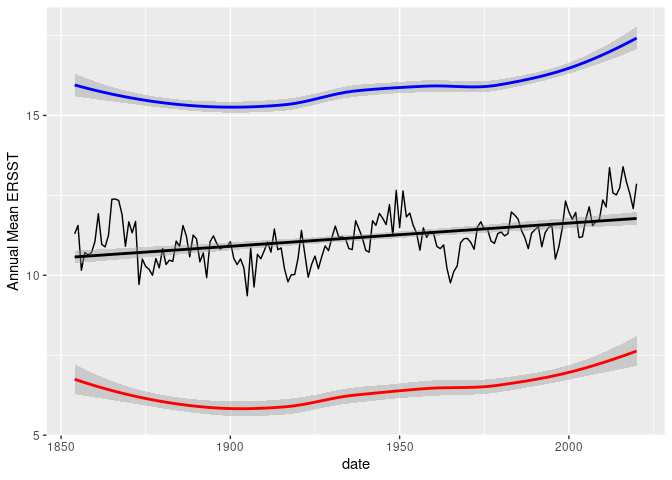

GOM-series ERSST
================

``` r
source("../setup.R")
```

### ERSST monthly means

We downloaded monthly mean SST data from
[ERSST](https://www.ncei.noaa.gov/products/extended-reconstructed-sst).
We have downloaded this data previously using the
[ersst](https://github.com/BigelowLab/ersst) R package.

``` r
x <- read_ersst() |> 
  aggregate_ersst(by = "year") |>
  glimpse()
```

    ## Rows: 167
    ## Columns: 7
    ## $ date   <date> 1854-01-01, 1855-01-01, 1856-01-01, 1857-01-01, 1858-01-01, 18…
    ## $ min    <dbl> 4.369287, 5.535616, 2.839702, 4.789160, 3.753201, 4.600055, 4.6…
    ## $ q25    <dbl> 5.769245, 7.660247, 4.906132, 5.852482, 6.065974, 5.561553, 6.5…
    ## $ median <dbl> 10.864085, 10.591835, 9.104138, 10.565934, 10.382067, 10.152899…
    ## $ mean   <dbl> 11.297766, 11.559612, 10.157623, 10.711674, 10.635819, 10.71274…
    ## $ q75    <dbl> 16.12139, 16.05675, 15.31264, 15.32716, 15.73708, 15.43691, 15.…
    ## $ max    <dbl> 19.00849, 18.74126, 18.60957, 17.70511, 18.75901, 17.92840, 18.…

``` r
ggplot(data = x, aes(x = date, y = mean)) +
  geom_line() + 
  labs(y = "Annual Mean ERSST") + 
  geom_smooth(method = "lm", se = TRUE, color = "black") +
  geom_smooth(aes(x = date, y = q25), color = "red") + 
  geom_smooth(aes(x = date, y = q75), color = "blue")
```

<!-- -->

### Updating the local dataset

It’s easy to build or renew the local dataset.

    r <- fetch_oisst()
