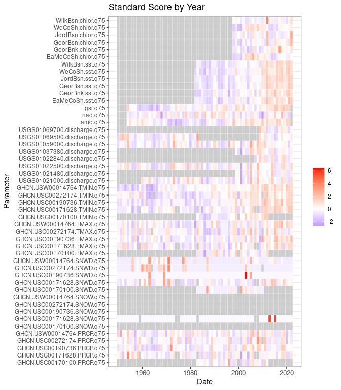

Export
================

``` r
source("../setup.R")
```

Each data set function suite has it’s own export functionality (by year,
month and possibly both) which yields a wide-format table with a leading
date column. A single function, `export()` will export all of the
datasets into one table (by year or by month). These may be subsequently
read into R using the `read_export()` function. Below we select columns
that include “q75” (75th percentile) and filter for dates from 1950
until recent. We standardize using the `scale` function which transforms
each variable to have a mean of 0 and a standard deviation of 1.

``` r
x = read_export(by = 'year') |>
                dplyr::select(date, dplyr::contains("q25")) |>
                dplyr::filter(date >= as.Date("1950-01-01")) |>
                standardize_export() |>
  dplyr::glimpse()
```

    ## Rows: 73
    ## Columns: 49
    ## $ date                       <date> 1950-01-01, 1951-01-01, 1952-01-01, 1953-0…
    ## $ GHCN.USC00170100.PRCP.q25  <dbl> NA, NA, NA, NA, NA, NA, NA, NA, NA, NA, NA,…
    ## $ GHCN.USC00171628.PRCP.q25  <dbl> NaN, NaN, NaN, NaN, NaN, NaN, NaN, NaN, NaN…
    ## $ GHCN.USC00190736.PRCP.q25  <dbl> NaN, NaN, NaN, NaN, NaN, NaN, NaN, NaN, NaN…
    ## $ GHCN.USC00272174.PRCP.q25  <dbl> NaN, NaN, NaN, NaN, NaN, NaN, NaN, NaN, NaN…
    ## $ GHCN.USW00014764.PRCP.q25  <dbl> NaN, NaN, NaN, NaN, NaN, NaN, NaN, NaN, NaN…
    ## $ GHCN.USC00170100.SNOW.q25  <dbl> NA, NA, NA, NA, NA, NA, NA, NA, NA, NA, NA,…
    ## $ GHCN.USC00171628.SNOW.q25  <dbl> NaN, NaN, NaN, NaN, NaN, NaN, NaN, NaN, NaN…
    ## $ GHCN.USC00190736.SNOW.q25  <dbl> NaN, NaN, NaN, NaN, NaN, NaN, NaN, NaN, NaN…
    ## $ GHCN.USC00272174.SNOW.q25  <dbl> NaN, NaN, NaN, NaN, NaN, NaN, NaN, NaN, NaN…
    ## $ GHCN.USW00014764.SNOW.q25  <dbl> NaN, NaN, NaN, NaN, NaN, NaN, NaN, NaN, NaN…
    ## $ GHCN.USC00170100.SNWD.q25  <dbl> NA, NA, NA, NA, NA, NA, NA, NA, NA, NA, NA,…
    ## $ GHCN.USC00171628.SNWD.q25  <dbl> NaN, NaN, NaN, NaN, NaN, NaN, NaN, NaN, NaN…
    ## $ GHCN.USC00190736.SNWD.q25  <dbl> NaN, NaN, NaN, NaN, NaN, NaN, NaN, NaN, NaN…
    ## $ GHCN.USC00272174.SNWD.q25  <dbl> NaN, NaN, NaN, NaN, NaN, NaN, NaN, NaN, NaN…
    ## $ GHCN.USW00014764.SNWD.q25  <dbl> NaN, NaN, NaN, NaN, NaN, NaN, NaN, NaN, NaN…
    ## $ GHCN.USC00170100.TMAX.q25  <dbl> NA, NA, NA, NA, NA, NA, NA, NA, NA, NA, NA,…
    ## $ GHCN.USC00171628.TMAX.q25  <dbl> -0.2708023, 0.9996574, -0.2708023, 1.952502…
    ## $ GHCN.USC00190736.TMAX.q25  <dbl> 0.2097494, 1.6558551, -0.2155758, 2.0811803…
    ## $ GHCN.USC00272174.TMAX.q25  <dbl> 0.1164846, 1.7608932, -0.9475445, 2.2445428…
    ## $ GHCN.USW00014764.TMAX.q25  <dbl> 0.1759839, 0.7599305, 0.1759839, 2.9010680,…
    ## $ GHCN.USC00170100.TMIN.q25  <dbl> NA, NA, NA, NA, NA, NA, NA, NA, NA, NA, NA,…
    ## $ GHCN.USC00171628.TMIN.q25  <dbl> -0.27777929, 0.27329295, 0.57387780, 1.6760…
    ## $ GHCN.USC00190736.TMIN.q25  <dbl> -0.0507944, 1.1314636, 0.4865956, 2.3137217…
    ## $ GHCN.USC00272174.TMIN.q25  <dbl> -0.518404552, 0.978519597, 0.978519597, 1.9…
    ## $ GHCN.USW00014764.TMIN.q25  <dbl> -0.7223643, 0.2624549, 0.2624549, 0.7996290…
    ## $ USGS01021000.discharge.q25 <dbl> NA, NA, NA, NA, NA, NA, NA, NA, NA, NA, 0.0…
    ## $ USGS01021480.discharge.q25 <dbl> NA, NA, NA, NA, NA, NA, NA, NA, NA, NA, NA,…
    ## $ USGS01022500.discharge.q25 <dbl> -0.97028991, 1.73357592, -0.97028991, -0.04…
    ## $ USGS01022840.discharge.q25 <dbl> NA, NA, NA, NA, NA, NA, NA, NA, NA, NA, NA,…
    ## $ USGS01037380.discharge.q25 <dbl> NA, NA, NA, NA, NA, NA, NA, NA, NA, NA, NA,…
    ## $ USGS01059000.discharge.q25 <dbl> -0.04549356, 0.77398137, -0.87934525, -0.57…
    ## $ USGS01069500.discharge.q25 <dbl> -0.861649725, 1.949168795, 1.176965905, -0.…
    ## $ USGS01069700.discharge.q25 <dbl> NA, NA, NA, NA, NA, NA, NA, NA, NA, NA, NA,…
    ## $ amo.q25                    <dbl> NA, NA, NA, NA, 0.30098662, 0.92267584, -0.…
    ## $ nao.q25                    <dbl> NA, NA, NA, NA, 0.656287525, -0.907529863, …
    ## $ gsi.q25                    <dbl> NA, NA, NA, NA, 0.9342042, -0.1843843, -0.5…
    ## $ EaMeCoSh.sst.q25           <dbl> NA, NA, NA, NA, NA, NA, NA, NA, NA, NA, NA,…
    ## $ GeorBnk.sst.q25            <dbl> NA, NA, NA, NA, NA, NA, NA, NA, NA, NA, NA,…
    ## $ GeorBsn.sst.q25            <dbl> NA, NA, NA, NA, NA, NA, NA, NA, NA, NA, NA,…
    ## $ JordBsn.sst.q25            <dbl> NA, NA, NA, NA, NA, NA, NA, NA, NA, NA, NA,…
    ## $ WeCoSh.sst.q25             <dbl> NA, NA, NA, NA, NA, NA, NA, NA, NA, NA, NA,…
    ## $ WilkBsn.sst.q25            <dbl> NA, NA, NA, NA, NA, NA, NA, NA, NA, NA, NA,…
    ## $ EaMeCoSh.chlor.q25         <dbl> NA, NA, NA, NA, NA, NA, NA, NA, NA, NA, NA,…
    ## $ GeorBnk.chlor.q25          <dbl> NA, NA, NA, NA, NA, NA, NA, NA, NA, NA, NA,…
    ## $ GeorBsn.chlor.q25          <dbl> NA, NA, NA, NA, NA, NA, NA, NA, NA, NA, NA,…
    ## $ JordBsn.chlor.q25          <dbl> NA, NA, NA, NA, NA, NA, NA, NA, NA, NA, NA,…
    ## $ WeCoSh.chlor.q25           <dbl> NA, NA, NA, NA, NA, NA, NA, NA, NA, NA, NA,…
    ## $ WilkBsn.chlor.q25          <dbl> NA, NA, NA, NA, NA, NA, NA, NA, NA, NA, NA,…

We can plot a heat map for the above.

``` r
plot_export(x, title = "Standardized Q25 by year")
```


Other descriptive metircs can be shown.

``` r
read_export(by = 'year') |>
                dplyr::select(date, dplyr::contains("q75")) |>
                dplyr::filter(date >= as.Date("1950-01-01")) |>
                standardize_export() |>
  plot_export(title = "Standardized Q75 by year")
```


