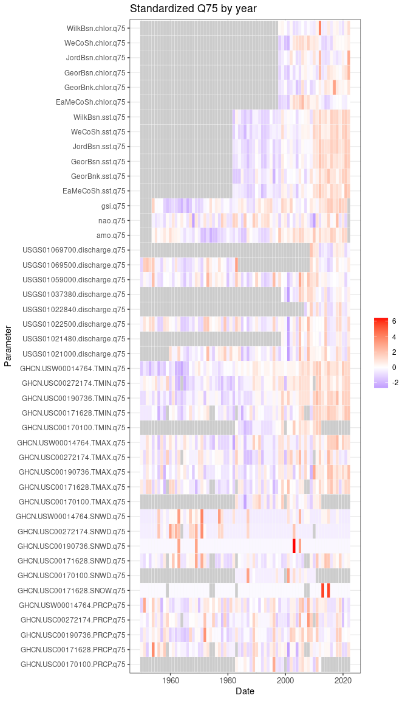

Export
================

``` r
source("../setup.R")
```

Each data set function suite has it’s own export functionality (by year,
month and possibly both) which yields a wide-format table with a leading
date column. A single function, `export()` will export all of the
datasets into one table (by year or by month). These may be subsequently
read into R using the `read_export()` function. Below we select columns
that include “q75” (75th percentile) and filter for dates from 1950
until recent. We standardize using the `scale` function which transforms
each variable to have a mean of 0 and a standard deviation of 1.

``` r
x = read_export(by = 'year') |>
                dplyr::select(date, dplyr::contains("q25")) |>
                dplyr::filter(date >= as.Date("1950-01-01")) |>
                standardize_export() |>
  dplyr::glimpse()
```

    ## Rows: 73
    ## Columns: 156
    ## $ date                                   <date> 1950-01-01, 1951-01-01, 1952-0…
    ## $ GHCN.USC00170100.PRCP.q25              <dbl> NA, NA, NA, NA, NA, NA, NA, NA,…
    ## $ GHCN.USC00171628.PRCP.q25              <dbl> NaN, NaN, NaN, NaN, NaN, NaN, N…
    ## $ GHCN.USC00190736.PRCP.q25              <dbl> NaN, NaN, NaN, NaN, NaN, NaN, N…
    ## $ GHCN.USC00272174.PRCP.q25              <dbl> NaN, NaN, NaN, NaN, NaN, NaN, N…
    ## $ GHCN.USW00014764.PRCP.q25              <dbl> NaN, NaN, NaN, NaN, NaN, NaN, N…
    ## $ GHCN.USC00170100.SNOW.q25              <dbl> NA, NA, NA, NA, NA, NA, NA, NA,…
    ## $ GHCN.USC00171628.SNOW.q25              <dbl> NaN, NaN, NaN, NaN, NaN, NaN, N…
    ## $ GHCN.USC00190736.SNOW.q25              <dbl> NaN, NaN, NaN, NaN, NaN, NaN, N…
    ## $ GHCN.USC00272174.SNOW.q25              <dbl> NaN, NaN, NaN, NaN, NaN, NaN, N…
    ## $ GHCN.USW00014764.SNOW.q25              <dbl> NaN, NaN, NaN, NaN, NaN, NaN, N…
    ## $ GHCN.USC00170100.SNWD.q25              <dbl> NA, NA, NA, NA, NA, NA, NA, NA,…
    ## $ GHCN.USC00171628.SNWD.q25              <dbl> NaN, NaN, NaN, NaN, NaN, NaN, N…
    ## $ GHCN.USC00190736.SNWD.q25              <dbl> NaN, NaN, NaN, NaN, NaN, NaN, N…
    ## $ GHCN.USC00272174.SNWD.q25              <dbl> NaN, NaN, NaN, NaN, NaN, NaN, N…
    ## $ GHCN.USW00014764.SNWD.q25              <dbl> NaN, NaN, NaN, NaN, NaN, NaN, N…
    ## $ GHCN.USC00170100.TMAX.q25              <dbl> NA, NA, NA, NA, NA, NA, NA, NA,…
    ## $ GHCN.USC00171628.TMAX.q25              <dbl> -0.2708023, 0.9996574, -0.27080…
    ## $ GHCN.USC00190736.TMAX.q25              <dbl> 0.2097494, 1.6558551, -0.215575…
    ## $ GHCN.USC00272174.TMAX.q25              <dbl> 0.1164846, 1.7608932, -0.947544…
    ## $ GHCN.USW00014764.TMAX.q25              <dbl> 0.1759839, 0.7599305, 0.1759839…
    ## $ GHCN.USC00170100.TMIN.q25              <dbl> NA, NA, NA, NA, NA, NA, NA, NA,…
    ## $ GHCN.USC00171628.TMIN.q25              <dbl> -0.27777929, 0.27329295, 0.5738…
    ## $ GHCN.USC00190736.TMIN.q25              <dbl> -0.0507944, 1.1314636, 0.486595…
    ## $ GHCN.USC00272174.TMIN.q25              <dbl> -0.518404552, 0.978519597, 0.97…
    ## $ GHCN.USW00014764.TMIN.q25              <dbl> -0.7223643, 0.2624549, 0.262454…
    ## $ USGS01021000.discharge.q25             <dbl> NA, NA, NA, NA, NA, NA, NA, NA,…
    ## $ USGS01021480.discharge.q25             <dbl> NA, NA, NA, NA, NA, NA, NA, NA,…
    ## $ USGS01022500.discharge.q25             <dbl> -0.97028991, 1.73357592, -0.970…
    ## $ USGS01022840.discharge.q25             <dbl> NA, NA, NA, NA, NA, NA, NA, NA,…
    ## $ USGS01037380.discharge.q25             <dbl> NA, NA, NA, NA, NA, NA, NA, NA,…
    ## $ USGS01059000.discharge.q25             <dbl> -0.04549356, 0.77398137, -0.879…
    ## $ USGS01069500.discharge.q25             <dbl> -0.861649725, 1.949168795, 1.17…
    ## $ USGS01069700.discharge.q25             <dbl> NA, NA, NA, NA, NA, NA, NA, NA,…
    ## $ amo.q25                                <dbl> NA, NA, NA, NA, 0.30098662, 0.9…
    ## $ nao.q25                                <dbl> NA, NA, NA, NA, 0.656287525, -0…
    ## $ gsi.q25                                <dbl> NA, NA, NA, NA, 0.9342042, -0.1…
    ## $ EaMeCoSh.sst.q25                       <dbl> NA, NA, NA, NA, NA, NA, NA, NA,…
    ## $ GeorBnk.sst.q25                        <dbl> NA, NA, NA, NA, NA, NA, NA, NA,…
    ## $ GeorBsn.sst.q25                        <dbl> NA, NA, NA, NA, NA, NA, NA, NA,…
    ## $ JordBsn.sst.q25                        <dbl> NA, NA, NA, NA, NA, NA, NA, NA,…
    ## $ WeCoSh.sst.q25                         <dbl> NA, NA, NA, NA, NA, NA, NA, NA,…
    ## $ WilkBsn.sst.q25                        <dbl> NA, NA, NA, NA, NA, NA, NA, NA,…
    ## $ EaMeCoSh.chlor.q25                     <dbl> NA, NA, NA, NA, NA, NA, NA, NA,…
    ## $ GeorBnk.chlor.q25                      <dbl> NA, NA, NA, NA, NA, NA, NA, NA,…
    ## $ GeorBsn.chlor.q25                      <dbl> NA, NA, NA, NA, NA, NA, NA, NA,…
    ## $ JordBsn.chlor.q25                      <dbl> NA, NA, NA, NA, NA, NA, NA, NA,…
    ## $ WeCoSh.chlor.q25                       <dbl> NA, NA, NA, NA, NA, NA, NA, NA,…
    ## $ WilkBsn.chlor.q25                      <dbl> NA, NA, NA, NA, NA, NA, NA, NA,…
    ## $ BUOY_B01.met.air_temperature.q25       <dbl> NA, NA, NA, NA, NA, NA, NA, NA,…
    ## $ BUOY_E01.met.air_temperature.q25       <dbl> NA, NA, NA, NA, NA, NA, NA, NA,…
    ## $ BUOY_F01.met.air_temperature.q25       <dbl> NA, NA, NA, NA, NA, NA, NA, NA,…
    ## $ BUOY_I01.met.air_temperature.q25       <dbl> NA, NA, NA, NA, NA, NA, NA, NA,…
    ## $ BUOY_M01.met.air_temperature.q25       <dbl> NA, NA, NA, NA, NA, NA, NA, NA,…
    ## $ BUOY_N01.met.air_temperature.q25       <dbl> NA, NA, NA, NA, NA, NA, NA, NA,…
    ## $ BUOY_B01.met.barometric_pressure.q25   <dbl> NA, NA, NA, NA, NA, NA, NA, NA,…
    ## $ BUOY_E01.met.barometric_pressure.q25   <dbl> NA, NA, NA, NA, NA, NA, NA, NA,…
    ## $ BUOY_F01.met.barometric_pressure.q25   <dbl> NA, NA, NA, NA, NA, NA, NA, NA,…
    ## $ BUOY_I01.met.barometric_pressure.q25   <dbl> NA, NA, NA, NA, NA, NA, NA, NA,…
    ## $ BUOY_M01.met.barometric_pressure.q25   <dbl> NA, NA, NA, NA, NA, NA, NA, NA,…
    ## $ BUOY_N01.met.barometric_pressure.q25   <dbl> NA, NA, NA, NA, NA, NA, NA, NA,…
    ## $ BUOY_B01.met.wind_gust.q25             <dbl> NA, NA, NA, NA, NA, NA, NA, NA,…
    ## $ BUOY_E01.met.wind_gust.q25             <dbl> NA, NA, NA, NA, NA, NA, NA, NA,…
    ## $ BUOY_F01.met.wind_gust.q25             <dbl> NA, NA, NA, NA, NA, NA, NA, NA,…
    ## $ BUOY_I01.met.wind_gust.q25             <dbl> NA, NA, NA, NA, NA, NA, NA, NA,…
    ## $ BUOY_M01.met.wind_gust.q25             <dbl> NA, NA, NA, NA, NA, NA, NA, NA,…
    ## $ BUOY_N01.met.wind_gust.q25             <dbl> NA, NA, NA, NA, NA, NA, NA, NA,…
    ## $ BUOY_B01.met.wind_speed.q25            <dbl> NA, NA, NA, NA, NA, NA, NA, NA,…
    ## $ BUOY_E01.met.wind_speed.q25            <dbl> NA, NA, NA, NA, NA, NA, NA, NA,…
    ## $ BUOY_F01.met.wind_speed.q25            <dbl> NA, NA, NA, NA, NA, NA, NA, NA,…
    ## $ BUOY_I01.met.wind_speed.q25            <dbl> NA, NA, NA, NA, NA, NA, NA, NA,…
    ## $ BUOY_M01.met.wind_speed.q25            <dbl> NA, NA, NA, NA, NA, NA, NA, NA,…
    ## $ BUOY_N01.met.wind_speed.q25            <dbl> NA, NA, NA, NA, NA, NA, NA, NA,…
    ## $ BUOY_B01.met.wind_direction.q25        <dbl> NA, NA, NA, NA, NA, NA, NA, NA,…
    ## $ BUOY_E01.met.wind_direction.q25        <dbl> NA, NA, NA, NA, NA, NA, NA, NA,…
    ## $ BUOY_F01.met.wind_direction.q25        <dbl> NA, NA, NA, NA, NA, NA, NA, NA,…
    ## $ BUOY_I01.met.wind_direction.q25        <dbl> NA, NA, NA, NA, NA, NA, NA, NA,…
    ## $ BUOY_M01.met.wind_direction.q25        <dbl> NA, NA, NA, NA, NA, NA, NA, NA,…
    ## $ BUOY_N01.met.wind_direction.q25        <dbl> NA, NA, NA, NA, NA, NA, NA, NA,…
    ## $ BUOY_B01.met.visibility.q25            <dbl> NA, NA, NA, NA, NA, NA, NA, NA,…
    ## $ BUOY_E01.met.visibility.q25            <dbl> NA, NA, NA, NA, NA, NA, NA, NA,…
    ## $ BUOY_F01.met.visibility.q25            <dbl> NA, NA, NA, NA, NA, NA, NA, NA,…
    ## $ BUOY_I01.met.visibility.q25            <dbl> NA, NA, NA, NA, NA, NA, NA, NA,…
    ## $ BUOY_M01.met.visibility.q25            <dbl> NA, NA, NA, NA, NA, NA, NA, NA,…
    ## $ BUOY_N01.met.visibility.q25            <dbl> NA, NA, NA, NA, NA, NA, NA, NA,…
    ## $ BUOY_B01.met.wind_direction_u.q25      <dbl> NA, NA, NA, NA, NA, NA, NA, NA,…
    ## $ BUOY_E01.met.wind_direction_u.q25      <dbl> NA, NA, NA, NA, NA, NA, NA, NA,…
    ## $ BUOY_F01.met.wind_direction_u.q25      <dbl> NA, NA, NA, NA, NA, NA, NA, NA,…
    ## $ BUOY_I01.met.wind_direction_u.q25      <dbl> NA, NA, NA, NA, NA, NA, NA, NA,…
    ## $ BUOY_M01.met.wind_direction_u.q25      <dbl> NA, NA, NA, NA, NA, NA, NA, NA,…
    ## $ BUOY_N01.met.wind_direction_u.q25      <dbl> NA, NA, NA, NA, NA, NA, NA, NA,…
    ## $ BUOY_B01.met.wind_direction_v.q25      <dbl> NA, NA, NA, NA, NA, NA, NA, NA,…
    ## $ BUOY_E01.met.wind_direction_v.q25      <dbl> NA, NA, NA, NA, NA, NA, NA, NA,…
    ## $ BUOY_F01.met.wind_direction_v.q25      <dbl> NA, NA, NA, NA, NA, NA, NA, NA,…
    ## $ BUOY_I01.met.wind_direction_v.q25      <dbl> NA, NA, NA, NA, NA, NA, NA, NA,…
    ## $ BUOY_M01.met.wind_direction_v.q25      <dbl> NA, NA, NA, NA, NA, NA, NA, NA,…
    ## $ BUOY_N01.met.wind_direction_v.q25      <dbl> NA, NA, NA, NA, NA, NA, NA, NA,…
    ## $ BUOY_B01.ctd.temperature.q25           <dbl> NA, NA, NA, NA, NA, NA, NA, NA,…
    ## $ BUOY_F01.ctd.temperature.q25           <dbl> NA, NA, NA, NA, NA, NA, NA, NA,…
    ## $ BUOY_I01.ctd.temperature.q25           <dbl> NA, NA, NA, NA, NA, NA, NA, NA,…
    ## $ BUOY_M01.ctd.temperature.q25           <dbl> NA, NA, NA, NA, NA, NA, NA, NA,…
    ## $ BUOY_N01.ctd.temperature.q25           <dbl> NA, NA, NA, NA, NA, NA, NA, NA,…
    ## $ BUOY_B01.ctd.salinity.q25              <dbl> NA, NA, NA, NA, NA, NA, NA, NA,…
    ## $ BUOY_F01.ctd.salinity.q25              <dbl> NA, NA, NA, NA, NA, NA, NA, NA,…
    ## $ BUOY_I01.ctd.salinity.q25              <dbl> NA, NA, NA, NA, NA, NA, NA, NA,…
    ## $ BUOY_M01.ctd.salinity.q25              <dbl> NA, NA, NA, NA, NA, NA, NA, NA,…
    ## $ BUOY_N01.ctd.salinity.q25              <dbl> NA, NA, NA, NA, NA, NA, NA, NA,…
    ## $ BUOY_B01.ctd.sigma_t.q25               <dbl> NA, NA, NA, NA, NA, NA, NA, NA,…
    ## $ BUOY_F01.ctd.sigma_t.q25               <dbl> NA, NA, NA, NA, NA, NA, NA, NA,…
    ## $ BUOY_I01.ctd.sigma_t.q25               <dbl> NA, NA, NA, NA, NA, NA, NA, NA,…
    ## $ BUOY_M01.ctd.sigma_t.q25               <dbl> NA, NA, NA, NA, NA, NA, NA, NA,…
    ## $ BUOY_N01.ctd.sigma_t.q25               <dbl> NA, NA, NA, NA, NA, NA, NA, NA,…
    ## $ BUOY_B01.rtsc.current_speed.q25        <dbl> NA, NA, NA, NA, NA, NA, NA, NA,…
    ## $ BUOY_E01.rtsc.current_speed.q25        <dbl> NA, NA, NA, NA, NA, NA, NA, NA,…
    ## $ BUOY_F01.rtsc.current_speed.q25        <dbl> NA, NA, NA, NA, NA, NA, NA, NA,…
    ## $ BUOY_I01.rtsc.current_speed.q25        <dbl> NA, NA, NA, NA, NA, NA, NA, NA,…
    ## $ BUOY_M01.rtsc.current_speed.q25        <dbl> NA, NA, NA, NA, NA, NA, NA, NA,…
    ## $ BUOY_N01.rtsc.current_speed.q25        <dbl> NA, NA, NA, NA, NA, NA, NA, NA,…
    ## $ BUOY_B01.rtsc.current_direction.q25    <dbl> NA, NA, NA, NA, NA, NA, NA, NA,…
    ## $ BUOY_E01.rtsc.current_direction.q25    <dbl> NA, NA, NA, NA, NA, NA, NA, NA,…
    ## $ BUOY_F01.rtsc.current_direction.q25    <dbl> NA, NA, NA, NA, NA, NA, NA, NA,…
    ## $ BUOY_I01.rtsc.current_direction.q25    <dbl> NA, NA, NA, NA, NA, NA, NA, NA,…
    ## $ BUOY_M01.rtsc.current_direction.q25    <dbl> NA, NA, NA, NA, NA, NA, NA, NA,…
    ## $ BUOY_N01.rtsc.current_direction.q25    <dbl> NA, NA, NA, NA, NA, NA, NA, NA,…
    ## $ BUOY_B01.rtsc.temperature.q25          <dbl> NA, NA, NA, NA, NA, NA, NA, NA,…
    ## $ BUOY_E01.rtsc.temperature.q25          <dbl> NA, NA, NA, NA, NA, NA, NA, NA,…
    ## $ BUOY_F01.rtsc.temperature.q25          <dbl> NA, NA, NA, NA, NA, NA, NA, NA,…
    ## $ BUOY_I01.rtsc.temperature.q25          <dbl> NA, NA, NA, NA, NA, NA, NA, NA,…
    ## $ BUOY_M01.rtsc.temperature.q25          <dbl> NA, NA, NA, NA, NA, NA, NA, NA,…
    ## $ BUOY_N01.rtsc.temperature.q25          <dbl> NA, NA, NA, NA, NA, NA, NA, NA,…
    ## $ BUOY_B01.rtsc.current_direction_u.q25  <dbl> NA, NA, NA, NA, NA, NA, NA, NA,…
    ## $ BUOY_E01.rtsc.current_direction_u.q25  <dbl> NA, NA, NA, NA, NA, NA, NA, NA,…
    ## $ BUOY_F01.rtsc.current_direction_u.q25  <dbl> NA, NA, NA, NA, NA, NA, NA, NA,…
    ## $ BUOY_I01.rtsc.current_direction_u.q25  <dbl> NA, NA, NA, NA, NA, NA, NA, NA,…
    ## $ BUOY_M01.rtsc.current_direction_u.q25  <dbl> NA, NA, NA, NA, NA, NA, NA, NA,…
    ## $ BUOY_N01.rtsc.current_direction_u.q25  <dbl> NA, NA, NA, NA, NA, NA, NA, NA,…
    ## $ BUOY_B01.rtsc.current_direction_v.q25  <dbl> NA, NA, NA, NA, NA, NA, NA, NA,…
    ## $ BUOY_E01.rtsc.current_direction_v.q25  <dbl> NA, NA, NA, NA, NA, NA, NA, NA,…
    ## $ BUOY_F01.rtsc.current_direction_v.q25  <dbl> NA, NA, NA, NA, NA, NA, NA, NA,…
    ## $ BUOY_I01.rtsc.current_direction_v.q25  <dbl> NA, NA, NA, NA, NA, NA, NA, NA,…
    ## $ BUOY_M01.rtsc.current_direction_v.q25  <dbl> NA, NA, NA, NA, NA, NA, NA, NA,…
    ## $ BUOY_N01.rtsc.current_direction_v.q25  <dbl> NA, NA, NA, NA, NA, NA, NA, NA,…
    ## $ BUOY_B01.optics.solar_zenith_angle.q25 <dbl> NA, NA, NA, NA, NA, NA, NA, NA,…
    ## $ BUOY_E01.optics.solar_zenith_angle.q25 <dbl> NA, NA, NA, NA, NA, NA, NA, NA,…
    ## $ BUOY_I01.optics.solar_zenith_angle.q25 <dbl> NA, NA, NA, NA, NA, NA, NA, NA,…
    ## $ BUOY_M01.optics.solar_zenith_angle.q25 <dbl> NA, NA, NA, NA, NA, NA, NA, NA,…
    ## $ BUOY_B01.optics.Ed_PAR.q25             <dbl> NA, NA, NA, NA, NA, NA, NA, NA,…
    ## $ BUOY_E01.optics.Ed_PAR.q25             <dbl> NA, NA, NA, NA, NA, NA, NA, NA,…
    ## $ BUOY_I01.optics.Ed_PAR.q25             <dbl> NA, NA, NA, NA, NA, NA, NA, NA,…
    ## $ BUOY_M01.optics.Ed_PAR.q25             <dbl> NA, NA, NA, NA, NA, NA, NA, NA,…
    ## $ BUOY_B01.optics.chlorophyll.q25        <dbl> NA, NA, NA, NA, NA, NA, NA, NA,…
    ## $ BUOY_E01.optics.chlorophyll.q25        <dbl> NA, NA, NA, NA, NA, NA, NA, NA,…
    ## $ BUOY_I01.optics.chlorophyll.q25        <dbl> NA, NA, NA, NA, NA, NA, NA, NA,…
    ## $ BUOY_M01.optics.chlorophyll.q25        <dbl> NA, NA, NA, NA, NA, NA, NA, NA,…
    ## $ BUOY_B01.adcp.current_u.q25            <lgl> NA, NA, NA, NA, NA, NA, NA, NA,…
    ## $ BUOY_B01.adcp.current_v.q25            <lgl> NA, NA, NA, NA, NA, NA, NA, NA,…

We can plot a heat map for the above.

``` r
plot_export(x, title = "Standardized Q25 by year", purge_empty = FALSE)
```


Other descriptive metrics can be shown. This time we drop the buoy data
and purge empty rows to improve readability.

``` r
read_export(by = 'year') |>
                dplyr::select(date, dplyr::contains("q75") & !dplyr::starts_with("BUOY")) |>
                dplyr::filter(date >= as.Date("1950-01-01")) |>
                standardize_export() |>
  plot_export(title = "Standardized Q75 by year", purge = TRUE)
```



And now with buoys only, note that we filter for dates after 2000.

``` r
read_export(by = 'year') |>
                dplyr::select(date, dplyr::starts_with("BUOY") & dplyr::contains("median") ) |>
                dplyr::filter(date >= as.Date("2000-01-01")) |>
                standardize_export() |>
  plot_export(title = "Standardized median by year", purge = FALSE)
```


