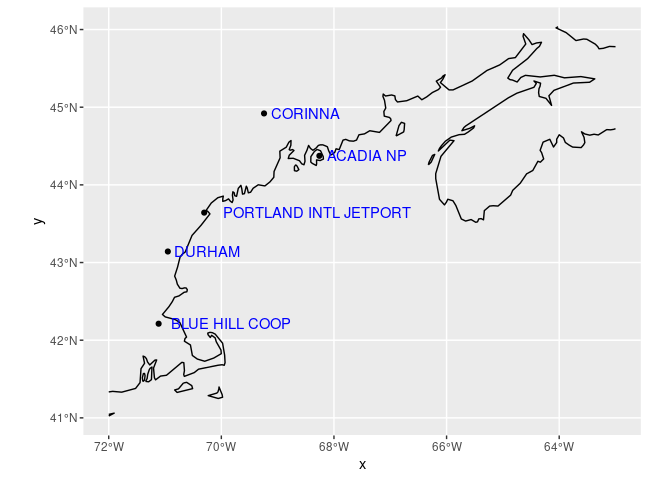
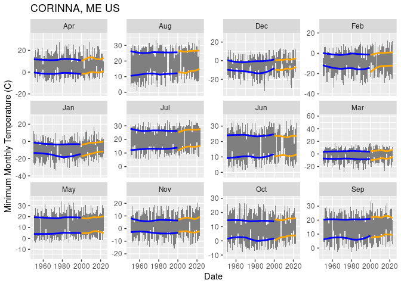
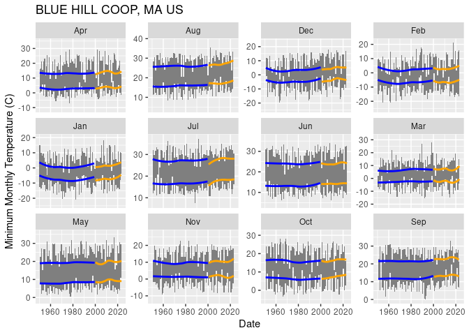
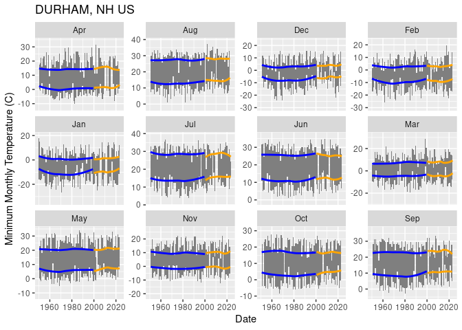
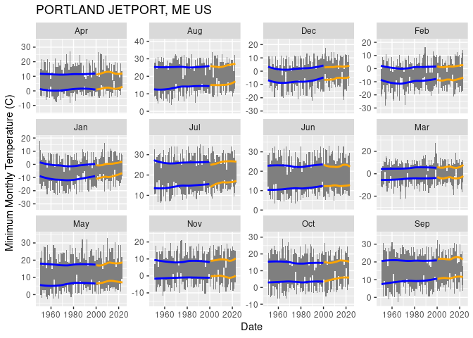
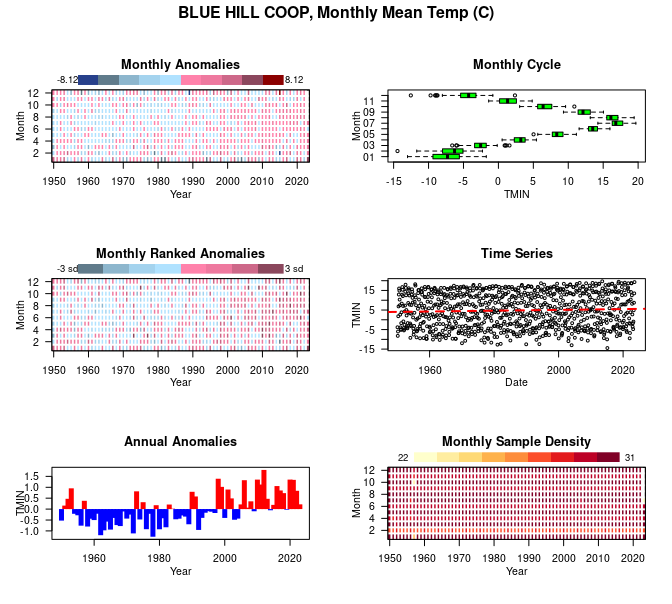
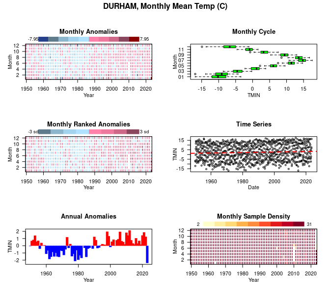
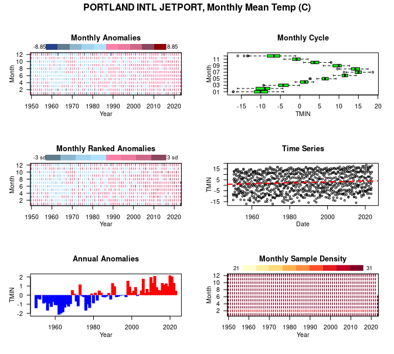

GOM-series GHCN daily
================

> For Canadian data see [ClimateData](https://climatedata.ca) and the
> [inventory](https://climatedata.ca/download/#station-download).

``` r
source("../setup.R")
```

### GHCNd

We use the [ghcnd](https://github.com/BigelowLab/ghcnd) R package to
downlaod and wrangle daily data from NOAA’s [Global Historical
Climatology Network daily
(GHCNd)](https://www.ncei.noaa.gov/products/land-based-station/global-historical-climatology-network-daily).
We aggregate these daily values into monthly means.

We need to narrow the selection of stations into those along that lie
around the perimeter of the Gulf of Maine. We also hope to find stations
that provide long time series covering the intervals 1950-2000 and
2000-present. We retrieved the sation listing and saved it for
subsequent use. This code block is disabled so the file is not rewritten
needlessly.

    station_ids = c(PWM = "USW00014764",
                    BHC = "USC00190736",
                    #LIA = "USW00014739",
                    DNH = "USC00272174",
                    ANP = "USC00170100",
                    COR = "USC00171628")
    stations = fetch_station_list() |>
      dplyr::filter(id %in% station_ids) |>
      sf::write_sf(here::here("data","ghcn", "station_list.gpkg"))

For subsequent use you can use `ghcn_lut()` to read it form the local
file.

``` r
stations = ghcn_lut()
stations
```

    ## Simple feature collection with 5 features and 7 fields
    ## Geometry type: POINT
    ## Dimension:     XY
    ## Bounding box:  xmin: -71.1136 ymin: 42.2122 xmax: -68.2592 ymax: 44.9197
    ## Geodetic CRS:  WGS 84
    ## # A tibble: 5 × 8
    ##   id          elev state name  gsn_flag hcn_flag wmoid               geom
    ##   <chr>      <dbl> <chr> <chr> <chr>    <chr>    <chr>        <POINT [°]>
    ## 1 USC001701… 143.  ME    ACAD… <NA>     HCN      <NA>  (-68.2592 44.3739)
    ## 2 USC001716…  90.5 ME    CORI… <NA>     HCN      <NA>  (-69.2417 44.9197)
    ## 3 USC001907… 190.  MA    BLUE… <NA>     HCN      <NA>  (-71.1136 42.2122)
    ## 4 USC002721…  22.9 NH    DURH… <NA>     HCN      <NA>    (-70.95 43.1433)
    ## 5 USW000147…  13.7 ME    PORT… <NA>     HCN      72606 (-70.3003 43.6497)

Now we can access a more detailed inventory listing for each station.

``` r
inv = fetch_inventory(stations = stations) |>
  dplyr::mutate(duration = lastyear - firstyear + 1)
inv
```

    ## Simple feature collection with 137 features and 6 fields
    ## Geometry type: POINT
    ## Dimension:     XY
    ## Bounding box:  xmin: -71.1136 ymin: 42.2122 xmax: -68.2592 ymax: 44.9197
    ## Geodetic CRS:  WGS 84
    ## # A tibble: 137 × 7
    ##    id        element firstyear lastyear           geometry duration name     
    ##  * <chr>     <chr>       <dbl>    <dbl>        <POINT [°]>    <dbl> <chr>    
    ##  1 USC00170… TMAX         1982     2014 (-68.2592 44.3739)       33 ACADIA NP
    ##  2 USC00170… TMIN         1982     2014 (-68.2592 44.3739)       33 ACADIA NP
    ##  3 USC00170… TOBS         1982     2014 (-68.2592 44.3739)       33 ACADIA NP
    ##  4 USC00170… PRCP         1982     2014 (-68.2592 44.3739)       33 ACADIA NP
    ##  5 USC00170… SNOW         1982     2010 (-68.2592 44.3739)       29 ACADIA NP
    ##  6 USC00170… SNWD         1982     2010 (-68.2592 44.3739)       29 ACADIA NP
    ##  7 USC00170… DAPR         1988     2004 (-68.2592 44.3739)       17 ACADIA NP
    ##  8 USC00170… DASF         2003     2004 (-68.2592 44.3739)        2 ACADIA NP
    ##  9 USC00170… MDPR         1988     2006 (-68.2592 44.3739)       19 ACADIA NP
    ## 10 USC00170… MDSF         2003     2005 (-68.2592 44.3739)        3 ACADIA NP
    ## # ℹ 127 more rows

And show the locations of the stations.

``` r
bb = sf::st_bbox(c(xmin = -72, ymin = 39, xmax = -63,  ymax = 46), crs = 4326) |>
  sf::st_as_sfc()
coast = rnaturalearth::ne_coastline(scale= 'medium', returnclass = 'sf') |>
  sf::st_crop(bb)

tmax = filter(inv, element == "TMAX")
ggplot(data = tmax) +
  geom_sf(size = 1.5) +
  geom_sf(data = st_geometry(coast)) +
  geom_sf_text(data = tmax, aes(label = name), 
               color = "blue", hjust = -0.1)
```

<!-- --> We can
now read in the per station per element data. We group the data into two
epochs, 1950-1999 and 2000-present.

``` r
DATES = c(as.Date(c("1950-01-01", "2000-01-01")), Sys.Date())
x = fetch_station(inv) |>
  dplyr::filter(DATE >= DATES[1]) |>
  dplyr::mutate(TDIFF = TMAX - TMIN, 
                MONTH = format(DATE, "%b"), 
                .before = geometry)
ix <- findInterval(x$DATE, DATES)
x = dplyr::ungroup(x) |>
  dplyr::mutate(EPOCH = factor(as.character(sort(unique(ix)))[ix]), .after = DATE) |>
  dplyr::group_by(STATION, EPOCH) 
```

Let’s look at the station data - plotting the TMIN-to-TMAX range per
month range as a gray ribbon. Superimposed are the loess smoothing lines
for each epoch.

``` r
plot_envelope = function(x){
  ggplot(data = x,  aes(x = DATE, y = TMIN)) +
  geom_ribbon(aes(ymin = TMIN, ymax = TMAX), fill = 'gray50') +
   geom_smooth(data = dplyr::filter(x, EPOCH == 1), 
    aes(x = DATE, y = TMIN), method = loess, formula = y ~ x, se = FALSE, color = "blue") +
  geom_smooth(data = dplyr::filter(x, EPOCH == 2), 
    aes(x = DATE, y = TMIN), method = loess, formula = y ~ x, se = FALSE, color = "orange") +
  geom_smooth(data = dplyr::filter(x, EPOCH == 1), 
    aes(x = DATE, y = TMAX), method = loess, formula = y ~ x, se = FALSE, color = "blue") +
  geom_smooth(data = dplyr::filter(x, EPOCH == 2), 
    aes(x = DATE, y = TMAX), method = loess, formula = y ~ x, se = FALSE, color = "orange") +
  labs(x = "Date", y = "Minimum Monthly Temperature (C)", title = x$NAME[1]) + 
  facet_wrap(~ MONTH, scales = "free_y") 
}

gg = lapply(unique(x$STATION), function(id) plot_envelope(dplyr::filter(x, STATION == id)))

for (g in gg) print(g)
```

<!-- --><!-- --><!-- --><!-- --><!-- -->

Next we can view anomaly heat maps, but we start with the daily data.

``` r
x = fetch_station(inv) |>
  dplyr::filter(DATE >= DATES[1]) |>
  dplyr::mutate(TDIFF = TMAX - TMIN, .before = geometry)
```

``` r
for (id in unique(x$STATION)) {
  name = stations$name[stations$id == id]
  plot( stsaav::stsaav(dplyr::filter(x, STATION == id),
                                     t_step = "Month",
                                     tcol = "DATE",
                                     vcol = "TMIN"),
        main = paste0(name, ", Monthly Mean Temp (C)"))
}
```

<!-- --><!-- --><!-- --><!-- --><!-- -->

An alternative is to compute intervals means for months or years.

``` r
a = fetch_station(inv) |>
  aggregate_ghcn(by = 'year') |>
  dplyr::mutate(YEAR = as.numeric(format(date, "%Y")))

ggplot(data = a, aes(x = YEAR, y= PRCP.mean)) + 
  geom_line() + 
  labs(title = "Annual Mean Precipitation") + 
  facet_wrap(~NAME)
```

<!-- -->
