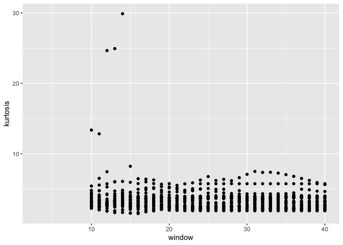

Kurtosis of Surprise Windows
================

``` r
source("../setup.R")
```

    ## here() starts at /Users/jevanilla/Documents/Bigelow/CODE/gom-series

``` r
x = read_export(by = 'year', 
                selection = read_target_vars(treatment = c("median")),
                replace_names = TRUE, 
                standardize = FALSE) |>
    dplyr::filter(date >= as.Date("1950-01-01"))
```

``` r
windows <- seq(3, 40, 1)
k_w <- tibble()

for (w in windows) {
  
  s = surprise(x, win = w)
  
  k <- kurtosis(s, na.rm=TRUE) 
  
  k_w <- bind_rows(k_w, k) 
}

glimpse(k_w)
```

    ## Rows: 38
    ## Columns: 33
    ## $ date                 <dbl> 1.799553, 1.799553, 1.799553, 1.799553, 1.799553,…
    ## $ `Androscoggin River` <dbl> NaN, NaN, NaN, NaN, NaN, NaN, NaN, 3.143289, 3.84…
    ## $ `Narraguagus River`  <dbl> NaN, NaN, NaN, NaN, NaN, NaN, NaN, 5.423416, 6.51…
    ## $ `Durham Prcp`        <dbl> NaN, NaN, NaN, NaN, NaN, NaN, NaN, NaN, NaN, NaN,…
    ## $ `Durham Tmax`        <dbl> NaN, NaN, NaN, NaN, NaN, NaN, NaN, 3.073521, 4.04…
    ## $ `Durham Tmin`        <dbl> NaN, NaN, NaN, NaN, NaN, NaN, NaN, 3.273655, 4.77…
    ## $ `Blue Hill Prcp`     <dbl> NaN, NaN, NaN, NaN, NaN, NaN, NaN, NaN, NaN, NaN,…
    ## $ `Blue Hill Tmax`     <dbl> NaN, NaN, NaN, NaN, NaN, NaN, NaN, 3.203643, 3.51…
    ## $ `Blue Hill Tmin`     <dbl> NaN, NaN, NaN, NaN, NaN, NaN, NaN, 4.508755, 4.74…
    ## $ `Corinna Prcp`       <dbl> NaN, NaN, NaN, NaN, NaN, NaN, NaN, NaN, NaN, NaN,…
    ## $ `Corinna Tmax`       <dbl> NaN, NaN, NaN, NaN, NaN, NaN, NaN, 3.216525, 3.37…
    ## $ `Corinna Tmin`       <dbl> NaN, NaN, NaN, NaN, NaN, NaN, NaN, 2.569855, 2.65…
    ## $ NAO                  <dbl> NaN, NaN, NaN, NaN, NaN, NaN, NaN, 3.183516, 2.95…
    ## $ AMO                  <dbl> NaN, NaN, NaN, NaN, NaN, NaN, NaN, 2.789311, 3.06…
    ## $ GSI                  <dbl> NaN, NaN, NaN, NaN, NaN, NaN, NaN, 3.036176, 2.50…
    ## $ `EMCC (SST)`         <dbl> NaN, NaN, NaN, NaN, NaN, NaN, NaN, 2.659977, 2.62…
    ## $ `GBK (SST)`          <dbl> NaN, NaN, NaN, NaN, NaN, NaN, NaN, 4.314426, 3.47…
    ## $ `GBN (SST)`          <dbl> NaN, NaN, NaN, NaN, NaN, NaN, NaN, 3.696309, 3.24…
    ## $ `JBN (SST)`          <dbl> NaN, NaN, NaN, NaN, NaN, NaN, NaN, 3.997600, 4.16…
    ## $ `WMCC (SST)`         <dbl> NaN, NaN, NaN, NaN, NaN, NaN, NaN, 2.294528, 2.08…
    ## $ `WBN (SST)`          <dbl> NaN, NaN, NaN, NaN, NaN, NaN, NaN, 2.264293, 2.47…
    ## $ `EMCC (Chl)`         <dbl> NaN, NaN, NaN, NaN, NaN, NaN, NaN, 2.567794, 2.40…
    ## $ `GBK (Chl)`          <dbl> NaN, NaN, NaN, NaN, NaN, NaN, NaN, 2.671139, 2.51…
    ## $ `GBN (Chl)`          <dbl> NaN, NaN, NaN, NaN, NaN, NaN, NaN, 2.450294, 2.03…
    ## $ `JBN (Chl)`          <dbl> NaN, NaN, NaN, NaN, NaN, NaN, NaN, 4.817047, 5.56…
    ## $ `WMCC (Chl)`         <dbl> NaN, NaN, NaN, NaN, NaN, NaN, NaN, 2.827490, 2.30…
    ## $ `WBN (Chl)`          <dbl> NaN, NaN, NaN, NaN, NaN, NaN, NaN, 2.707455, 2.88…
    ## $ `PCI spring`         <dbl> NaN, NaN, NaN, NaN, NaN, NaN, NaN, 2.787112, 2.96…
    ## $ `PCI fall`           <dbl> NaN, NaN, NaN, NaN, NaN, NaN, NaN, 13.370379, 12.…
    ## $ `WMCC (HAB)`         <dbl> NaN, NaN, NaN, NaN, NaN, NaN, NaN, 4.257402, 3.46…
    ## $ `EMCC (HAB)`         <dbl> NaN, NaN, NaN, NaN, NaN, NaN, NaN, 3.457772, 3.77…
    ## $ `Cal spring`         <dbl> NaN, NaN, NaN, NaN, NaN, NaN, NaN, 3.132122, 3.08…
    ## $ `Cal fall`           <dbl> NaN, NaN, NaN, NaN, NaN, NaN, NaN, 3.766907, 3.35…

``` r
z <- k_w |>
  mutate(window = windows) |>
  pivot_longer(cols = `Androscoggin River`:`Cal fall`, names_to = "var", values_to = "kurtosis")

z
```

    ## # A tibble: 1,216 × 4
    ##     date window var                kurtosis
    ##    <dbl>  <dbl> <chr>                 <dbl>
    ##  1  1.80      3 Androscoggin River      NaN
    ##  2  1.80      3 Narraguagus River       NaN
    ##  3  1.80      3 Durham Prcp             NaN
    ##  4  1.80      3 Durham Tmax             NaN
    ##  5  1.80      3 Durham Tmin             NaN
    ##  6  1.80      3 Blue Hill Prcp          NaN
    ##  7  1.80      3 Blue Hill Tmax          NaN
    ##  8  1.80      3 Blue Hill Tmin          NaN
    ##  9  1.80      3 Corinna Prcp            NaN
    ## 10  1.80      3 Corinna Tmax            NaN
    ## # ℹ 1,206 more rows

``` r
ggplot(data=z, aes(x=window, y=kurtosis)) +
  geom_point()
```

    ## Warning: Removed 317 rows containing missing values (`geom_point()`).

<!-- -->

``` r
z |>
  arrange(desc(kurtosis))
```

    ## # A tibble: 1,216 × 4
    ##     date window var               kurtosis
    ##    <dbl>  <dbl> <chr>                <dbl>
    ##  1  1.80     14 PCI fall             29.9 
    ##  2  1.80     13 PCI fall             24.9 
    ##  3  1.80     12 PCI fall             24.7 
    ##  4  1.80     10 PCI fall             13.4 
    ##  5  1.80     11 PCI fall             12.8 
    ##  6  1.80     15 PCI fall              8.23
    ##  7  1.80     31 PCI fall              7.50
    ##  8  1.80     12 Narraguagus River     7.45
    ##  9  1.80     33 PCI fall              7.38
    ## 10  1.80     32 PCI fall              7.36
    ## # ℹ 1,206 more rows
