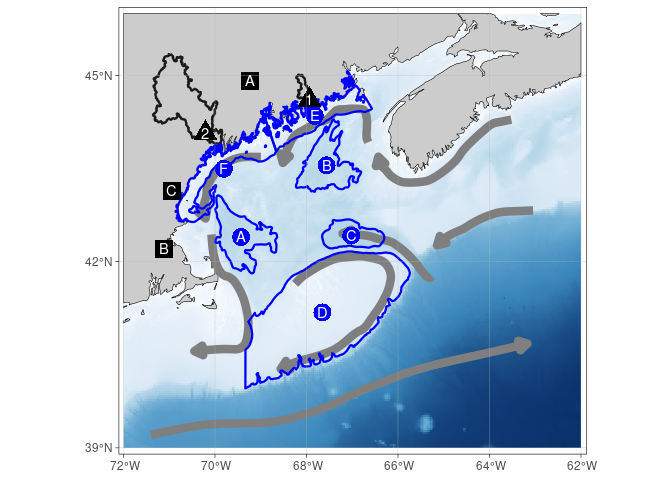

Pretty Map
================

``` r
source("../setup.R")
```

    ## here() starts at /mnt/s1/projects/ecocast/projects/nrecord/gom-series

``` r
base_map()
```

<!-- -->

Base bathymetry from GEBCO Compilation Group (2023) GEBCO 2023 Grid
(<doi:10.5285/f98b053b-0cbc-6c23-e053-6c86abc0af7b>). Marine regional
boundaries adapted from <https://www.marineregions.org/>. Watershed
boundaries adapted from U.S. Geological Survey, 2019, National
Hydrography Dataset (ver. USGS National Hydrography Dataset Best
Resolution (NHD) for Hydrologic Units (HU) 4 and 10 - 2001 (published
20191002)), accessed August 23, 2023 at URL
<https://www.usgs.gov/national-hydrography/access-national-hydrography-products>.
