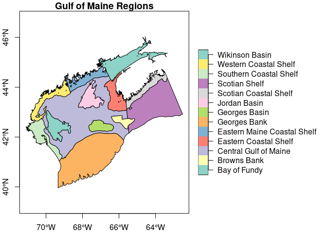
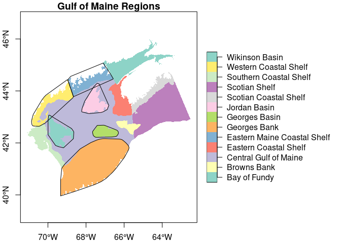

GoM-Series Regions
================

``` r
source("../setup.R")
```

Region definitions are adapted from
[MarineRegions.org](https://www.marineregions.org/gazetteer.php?p=details&id=8940).
The “North Coastal Shelf” extends from northern Massachusetts to Grand
Manan at the mouth of Fundy Bay. We split this region at Penobscot Bay
into “Western Coastal Shelf” and “Eastern Maine Coastal Shelf”.

``` r
x = read_regions(keep = 'all')
plot(x['region'],  
     main = "Gulf of Maine Regions", 
     axes = TRUE,
     key.width = lcm(7),
     key.pos = 4)
```

<!-- -->

Not that the regions object has both ‘region’ as well as user-assigned
‘name’ attributes. The ‘region’ attribute is assigned by [Marine
Regions](https://www.marineregions.org/gazetteer.php?p=details&id=8940).
These are broadly descriptive and can be difficult to use in plots and
tables. We manually assigned the `name` attribute to compose simpler
names, but complex enough to maintain their uniqueness.

We opt to use a smaller selection of the available regions by default:
“Wilkinson Basin”, “Jordan Basin”, “Georges Basin”, “Georges Bank”,
“Eastern Maine Coastal Shelf” and “Western Coastal Shelf”. Note below
that we drop the use of the `keep = 'all'` to get the subset.

We provide options for loading as bounding boxes…

``` r
bboxes = read_regions(form = 'bbox')
plot(x['region'], 
     main = "Gulf of Maine Regions", 
     axes = TRUE,
     key.width = lcm(7),
     key.pos = 4,
     border = NA,
     reset = FALSE)
plot(st_geometry(bboxes), add = TRUE)
```

<!-- -->

… or convex hulls…

``` r
chulls = read_regions(form = 'chull')
plot(x['region'],  
     main = "Gulf of Maine Regions", 
     axes = TRUE,
     key.width = lcm(7),
     key.pos = 4,
     border = NA,
     reset = FALSE)
plot(st_geometry(chulls), add = TRUE)
```

<!-- -->
