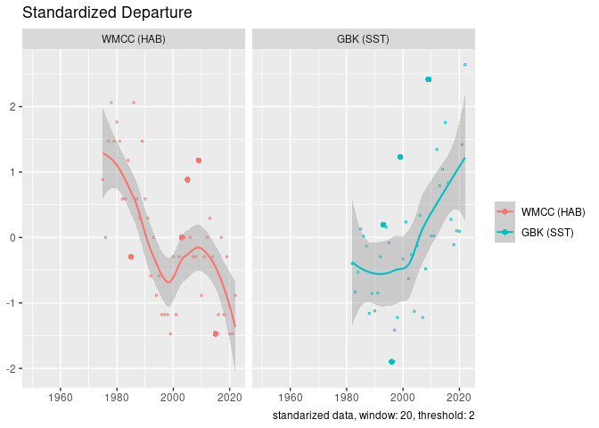
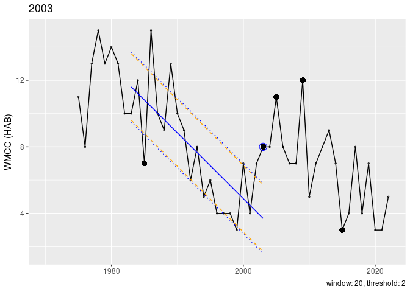
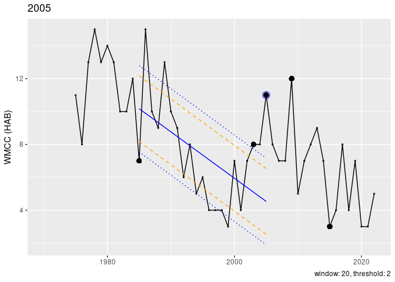

Reviewing Surprise
================

``` r
source("../setup.R")
```

    ## here() starts at /Users/jevanilla/Documents/Bigelow/CODE/gom-series

Below is a plot that shows standardized departures relative to the long
term mean with “surprises” indicated with a dot.

``` r
surprise_window = 20
surprise_threshold = 2
x = read_export(by = 'year', 
                selection = read_target_vars(treatment = c("median")),
                replace_names = TRUE, 
                standardize = FALSE) |>
    dplyr::filter(date >= as.Date("1950-01-01"))
plot_departure_surprise(x, surprise_window = surprise_window)
```

<!-- -->
For the most part it looks correct (no surprises!), but upon close
inspection you’ll note that sometimes the surprise falls on a low
departure year (over a whitish tile). For example, `WMCC (HAB)` (1985
and 2003) and `GBK (SST)` (1993) show this surprising result (among
others). That it possible - relative to the long-term mean an average
result might be surprising over a shorter period. But it feels
non-intuitive.

> Note that it is surprising that we find a surprise value in 1985 for
> `WMCC (HAB)` - as there are only 15 years for the 20 year window. This
> is because we allow a surprise to be computed with as few as 10
> non-missing values.

So let’s investigate those two parameters a bit more. First we use the
convenience function, `assemble_departure_surprise()` which produces
among other things a table of date, parameter, raw and standardized
values, and a flag noting a surprise event. This structure allows us to
view the data in multiple ways.

``` r
x20 = assemble_departure_surprise(surprise_window = surprise_window)$long |>
  filter(name %in% c("WMCC (HAB)", "GBK (SST)")) 
```

First we look at time series which is similar to the heat map shown
above, but more of a profile view for select parameters. The data for
each is smoothed using a `loess` smoother with standard errors shown
using the gray bands. The standard errors are not part of our analysis,
but are included to improve understanding of the fitted curve. Surprise
events (“surprises”) are noted with filled circle symbols.

``` r
plot_departure_surprise_series(x20, 
  caption = sprintf("standarized data, window: %i, threshold: %i", 
                    surprise_window, surprise_threshold),
  facet = TRUE,
  what = 'std',
  title = "Standardized Departure") |>
  print() |>
  suppressWarnings()
```

<!-- -->

Some of the surprises, say 2005 and 2009 for `WMCC (HAB)` seem obvious,
but what about 2003? Why is it a surprise? Let’s look more closely by
starting with an examination of 2001 followed by 2003 and 2005.

The plots below show the raw time series for `WMCC (HAB)` with surprises
highlighted as large filled dots and a specific year of interest
highlighted with a blue circle. The solid blue line is the line of best
fit for the window of 20 records prior to the year of interest. The line
has been extended an extra year so that we can more easily see how it
relates to the year of interest relates. Dotted lines above and below
show the surprise statistic we compute for the year of interest relative
to the preceding 20-year window.

``` r
x = compute_surprise_series()
```

The surprise metric computed for 2001 shows a very small difference from
the linear model for the preceding period; in fact, 2001’s HAB index
value happens to fall exactly on the line. The surprise metric is quite
low and dotted blue lines are not widely spaced. Our threshold to define
a surprise is `+/-2` as shown by the dotted lines. Clearly the surprise
metric for 2001 does not exceed the chosen threshold - thus no surprise
here.

``` r
plot_surprise_series(x, highlight = 2001, title = "2001") |>
  print() |>
  suppressWarnings()
```

<!-- -->

The surprise metric for 2003 is quite different than for 2001. The 2003
HAB value has departed greatly from the linear model fitted to the
preceding 20 years - thus the dotted lines representing the measured
surprise are widely spaced. Widely enough, in fact, to exceed the chosen
threshold of twp shown in the orange dashed line. This is what makes
2003 a surprise, but just barely.

``` r
plot_surprise_series(x, highlight = 2003, title = "2003") |>
  print() |>
  suppressWarnings() 
```

<!-- -->

Finally, the surprise for 2005 is shown below. In this case the surprise
metric (blue dotted lines) is obviously showing that the measured
surprise is quite large and well in excess of the chosen threshold
(orange dashed lines). This is unambiguously a surprise.

``` r
plot_surprise_series(x, highlight = 2005, title = "2005") |>
  print() |>
  suppressWarnings()
```

<!-- -->
