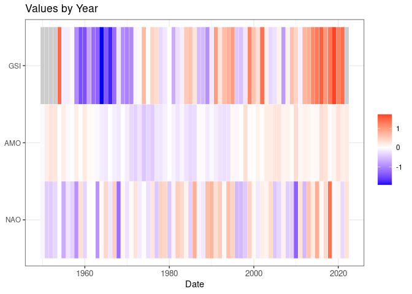
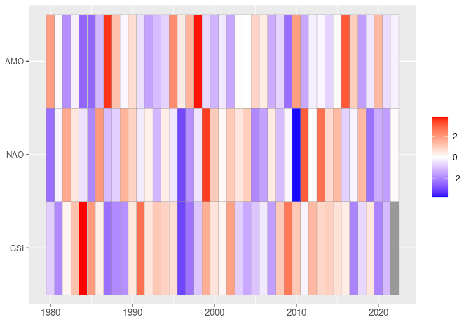

Surprise
================

``` r
source("../setup.R")
```

# Read in exported data

Read in the export data, but select just a few columns of interest and
filter to recent times.

``` r
x = read_export(by = 'year', standardize = FALSE) |>
  dplyr::select(date, dplyr::contains(c("nao.q25", "amo.q25", "gsi.q25", "nao.median", "amo.median", 
                                        "gsi.median", "nao.q75", "amo.q75", "gsi.q75"))) |>
   dplyr::filter(date >= as.Date("1950-01-01"))

plot_export(x)
```

<!-- -->

# Compute the surprise with a 20-year sliding window

Plot without binning into surprise categories.

``` r
win = 20
s = surprise(x, win = win) |>
  dplyr::filter(date >= as.Date("1980-01-01"))
```

    ## Warning: There was 1 warning in `dplyr::mutate()`.
    ## ℹ In argument: `dplyr::across(dplyr::where(is.numeric), surprise, win = win)`.
    ## Caused by warning:
    ## ! The `...` argument of `across()` is deprecated as of dplyr 1.1.0.
    ## Supply arguments directly to `.fns` through an anonymous function instead.
    ## 
    ##   # Previously
    ##   across(a:b, mean, na.rm = TRUE)
    ## 
    ##   # Now
    ##   across(a:b, \(x) mean(x, na.rm = TRUE))

``` r
plot_surprise(s, surprise = NULL)
```

<!-- -->

And plot again but this time as categorical “-surprise”, “no surprise”,
“surprise” groups.

``` r
plot_surprise(s, surprise = 2)
```

<!-- -->

``` r
x = read_export(by = 'year', standardize = FALSE) |>
  dplyr::select(-contains("BUOY"))
```

``` r
m = x |> select(contains(c("date", "median", "PCI", "hab"))) |>
  surprise(win = 20)

plot_surprise(m)
```

<!-- -->
