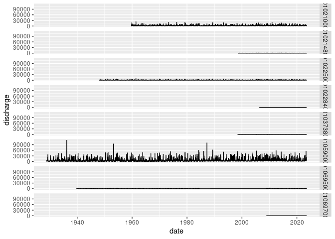
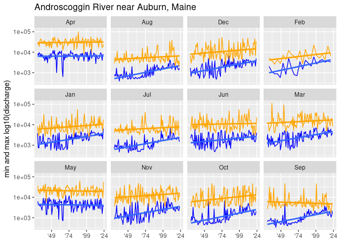
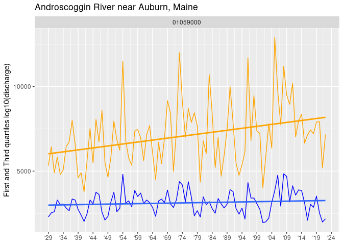

GOM-series stream guage data
================

``` r
source("../setup.R")
```

# How to access [USGS Stream Gauge data for Maine](https://waterdata.usgs.gov/me/nwis/rt)

## List stations of interest

``` r
stations <- usgs_lut()
stations
```

    ## # A tibble: 8 × 4
    ##   site_no  name                                      lat   lon
    ##   <chr>    <chr>                                   <dbl> <dbl>
    ## 1 01021000 St. Croix River at Baring, Maine         45.1 -67.3
    ## 2 01021480 Old Stream near Wesley, Maine            44.9 -67.7
    ## 3 01022500 Narraguagus River at Cherryfield, Maine  44.6 -67.9
    ## 4 01022840 Otter Creek near Bar Harbor, Maine       44.3 -68.2
    ## 5 01037380 Ducktrap River near Lincolnville, Maine  44.3 -69.1
    ## 6 01059000 Androscoggin River near Auburn, Maine    44.1 -70.2
    ## 7 01069500 Mousam River near West Kennebunk, Maine  43.4 -70.7
    ## 8 01069700 Branch Brook near Kennebunk, Maine       43.4 -70.6

## Use the `readNWISdv` function from the [dataRetrieval]() package to get daily discharge values from the stations of interest

The parameter code “00060” is for daily discharge values in ft^3/s

``` r
x <- fetch_usgs(stations, parameter = "00060")
x
```

    ## # A tibble: 137,070 × 4
    ##    agency_cd site_no  date       discharge
    ##    <chr>     <chr>    <date>         <dbl>
    ##  1 USGS      01021000 1959-10-01      2800
    ##  2 USGS      01021000 1959-10-02      2940
    ##  3 USGS      01021000 1959-10-03      1620
    ##  4 USGS      01021000 1959-10-04       656
    ##  5 USGS      01021000 1959-10-05      1870
    ##  6 USGS      01021000 1959-10-06      2670
    ##  7 USGS      01021000 1959-10-07      2850
    ##  8 USGS      01021000 1959-10-08      2950
    ##  9 USGS      01021000 1959-10-09      2880
    ## 10 USGS      01021000 1959-10-10      2780
    ## # ℹ 137,060 more rows

## Take a look at how much data is available per station

``` r
ggplot(data=x, aes(x=date, y=discharge)) +
  geom_line() +
  facet_grid(rows = "site_no")
```

<!-- -->

### Aggregate into monthly intervals

Here we select one station, “Androscoggin River near Auburn, Maine”, and
display the min and max monthly discharge. Note that we have a selection
of 6 metrics summarizing each month.

``` r
andro_month = aggregate_usgs(x, by = "month") |>
  dplyr::mutate(month = format(date, "%b")) |>
  dplyr::filter(site_no == "01059000") |>
  dplyr::glimpse()
```

    ## Rows: 1,063
    ## Columns: 9
    ## $ date    <date> 1928-12-01, 1929-01-01, 1929-03-01, 1929-04-01, 1929-05-01, 1…
    ## $ site_no <chr> "01059000", "01059000", "01059000", "01059000", "01059000", "0…
    ## $ min     <dbl> 1710, 3780, 1850, 8650, 6250, 2130, 690, 690, 640, 665, 835, 6…
    ## $ q25     <dbl> 3105, 4350, 4530, 11900, 11850, 3400, 2455, 1730, 1350, 2180, …
    ## $ median  <dbl> 3620, 4740, 6660, 14050, 14600, 3835, 2680, 2500, 2290, 2280, …
    ## $ mean    <dbl> 3799.355, 5181.613, 6893.871, 15249.667, 16639.355, 3785.333, …
    ## $ q75     <dbl> 4325, 5820, 8895, 18500, 20550, 4250, 3495, 2605, 2580, 2340, …
    ## $ max     <dbl> 6990, 8050, 12100, 24500, 36600, 5320, 4050, 2880, 2680, 3510,…
    ## $ month   <chr> "Dec", "Jan", "Mar", "Apr", "May", "Jun", "Jul", "Aug", "Sep",…

For the display we logscale to help reveal the “texture” of the minimum
flow rate.

``` r
ggplot(data = andro_month, aes(x = date, y = min)) +
  labs(y = "min and max log10(discharge)", title = "Androscoggin River near Auburn, Maine") + 
  geom_line(color = "blue", linewidth = 0.5) + 
  geom_smooth(method = "lm", se = FALSE) +
  geom_line(aes(x = date, y = max), color = "orange", linewidth = 0.5) + 
  geom_smooth(aes(x = date, y = max), method = "lm", se = FALSE, color = "orange") +
  scale_y_log10() + 
  scale_x_date(
    NULL,
    breaks = scales::breaks_width("25 years"),
    labels = scales::label_date("'%y")) + 
  facet_wrap(~ month)
```

    ## `geom_smooth()` using formula = 'y ~ x'
    ## `geom_smooth()` using formula = 'y ~ x'

<!-- -->

We can compute the same for annual summaries.

``` r
andro_year = aggregate_usgs(x, by = "year") |>
  dplyr::filter(site_no == "01059000") |>
  dplyr::glimpse()
```

    ## Rows: 94
    ## Columns: 8
    ## $ date    <date> 1929-01-01, 1930-01-01, 1931-01-01, 1932-01-01, 1933-01-01, 1…
    ## $ site_no <chr> "01059000", "01059000", "01059000", "01059000", "01059000", "0…
    ## $ min     <dbl> 640, 675, 685, 710, 640, 677, 600, 385, 760, 660, 440, 510, 34…
    ## $ q25     <dbl> 2290, 2530, 2600, 3290, 3030, 3050, 2820, 2660, 3350, 3290, 27…
    ## $ median  <dbl> 3330, 3680, 3180, 4090, 3780, 3810, 4010, 3640, 4970, 4040, 36…
    ## $ mean    <dbl> 5397.890, 5142.616, 4708.795, 5591.257, 5775.753, 5653.005, 56…
    ## $ q75     <dbl> 5320, 6430, 4900, 5830, 4800, 5070, 6460, 6730, 8000, 6590, 46…
    ## $ max     <dbl> 36600, 31700, 26000, 32000, 44300, 42300, 26600, 114000, 38400…

``` r
ggplot(data = andro_year, aes(x = date, y = q25)) + 
  geom_line(color = "blue", linewidth = 0.5) + 
  geom_smooth(method = "lm", se = FALSE) +
  geom_line(aes(y = q75), color = "orange") +
  geom_smooth(aes(x = date, y = q75), method = "lm", se = FALSE, color = "orange") +
  scale_x_date(
    NULL,
    breaks = scales::breaks_width("5 years"),
    labels = scales::label_date("'%y")) + 
  labs(y = "First and Third quartiles log10(discharge)",
       title = "Androscoggin River near Auburn, Maine") + 
  facet_wrap(~site_no)
```

    ## `geom_smooth()` using formula = 'y ~ x'
    ## `geom_smooth()` using formula = 'y ~ x'

<!-- -->
